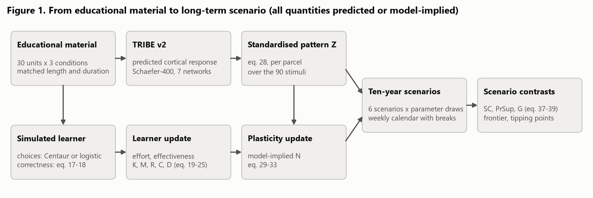

# 3. Methodology

## 3.1 Design overview and data generation

The study is a computational experiment. Figure 1 shows how the parts connect.

::: {custom-style="Image Caption"}
**Figure 1.** From educational material to long-term scenario
:::

*Source: own elaboration.*

Two layers are modelled separately. The first is the immediate response to reading a lesson. It is predicted for an
average adult and is therefore identical for every simulated learner (Phase II, Section 3.3). The second is learning:
what a learner does in each episode and how its knowledge, memory, reasoning, calibration and dependence change
(Phase III, Section 3.4), how the responses to the lessons it received accumulate into a model-implied functional
state (Phase IV, Section 3.6), and how both evolve over ten years (Phase V, Section 3.7). The two layers meet only in
Phase IV, and no step treats a predicted response as evidence of learning.

Table: **Table 2.** Data generated for the study

| Phase | What was generated | Quantity |
|-------------------------|-----------------------------------------------|---------------------------------------|
| I. Corpus | Unit records; lesson texts; control texts | 30 units; 90 lesson texts; 210 control texts |
| II. Predicted response | Predicted BOLD response per vertex and second | 660 text predictions (931 files, 8.70 GB) |
| III. Simulated learner | Episodes of simulated learners | 814,560 episodes, of which 9,600 with the hybrid engine |
| IV. Plasticity | Model-implied functional state | One state per learner and episode, derived post hoc |
| V. Ten-year scenarios | Monte Carlo runs over ten school years | 236 runs; $4.5 \times 10^{10}$ learner-episodes |

*Source: own elaboration; counts from the run records of each phase.*

Three principles govern the design. First, contrasts are within learners: every learner runs every arm from the same
starting point, in the same order and with the same random numbers, so that a difference between arms is not a
difference between people. Second, where realism and transparency conflict, transparency prevails: the correctness of
every answer comes from an explicit equation, and the language model trained on human choices makes only the choices
it was shown to adapt to a learner's record. Third, every assumption is explicit and varied: each parameter is
documented and, where possible, compared with published values (Section 3.5), and every modelling choice that could
defensibly have been made otherwise is varied in the robustness analysis (Section 3.8). Every long-run quantity is
therefore model-implied, and differences between arms are reported as scenario contrasts, never as treatment effects.
The equations not needed to follow the
argument are written out in the appendices, and Appendix F.5 gives the number each equation has in the code.

## 3.2 Phase I: the matched educational corpus

The instructional corpus has
two roles. Its lesson texts are the input to the encoding model (Section 3.3), and its problems, wrong options and
hints define the episodes of the simulated learners (Section 3.4). Both roles require the three versions of a unit to
differ in instructional policy while teaching the same concept.

### 3.2.1 Curriculum and unit specification

The curriculum has 30 units on 15 concepts from core MBA courses in managerial accounting, corporate finance, pricing
and marketing analytics. Each concept is taught twice, by applying the same method to a different situation, so that
the second encounter can draw on the learner's experience with the concept (Section 3.4). Units are ordered with
prerequisites first and then by difficulty. <!-- MG:2 questions, 1 is why is it 1 to 4 and not 1 to 5, 2 is where in the codebase can i see this.RISOLTO -->
<!-- MG: where in the codebase can i see this. RISOLTO-->

The MBA curriculum was chosen because the population of interest is business-school students and because every
answer in it is numerical, so that each can be checked automatically. The number of units was set by the available
computing resources, since each unit requires 22 runs of the encoding model. As a consequence, every unit-level
inference rests on 30 clusters, which limits its precision.

Each unit is a structured record: a problem, a near-transfer problem with the same structure and different
quantities, a far-transfer problem in a different context, a documented misconception, two wrong answer options,
three hints ordered from general to specific, a worked example and a worked solution.<!-- MG: where in the codebase can i see that there is the near-transfer, far-transfer, misconception, distractors, worked example and worked solution?. RISOLTO--><!-- MG:to add differences in traditional, scaffolding and substitution stimuli RISOLTO-->
Every answer is stored as a formula and recomputed when the corpus is loaded, and a unit whose stored answer
disagrees with its formula is rejected. Each wrong option is produced by an explicit rule: one encodes the documented
misconception, the other a second, distinct error. In a net-present-value unit, for example, one wrong option adds the
cash flows without discounting them. Every item is therefore a three-option choice in which each wrong option
corresponds to a named error.

### 3.2.2 Instructional conditions

The structure of every version is checked automatically: it must contain exactly the sections its condition
prescribes, in order, and reproduce the problem verbatim. The encoding model reads the full text of each version,
all sections in order<!-- MG:are we sure about this? i believe it only reads the problem and explanation. -->,
whereas the simulated learner reads only the explanation and the problem before its first attempt and receives
support turn by turn afterwards. In the AI conditions these turns are written at run time by a language-model tutor
(Section 3.4) and are never seen by the encoding model. The adaptation values of Table 5 are assumed constants that
enter the effectiveness of instruction (eq. 2); they are not properties of the texts, and Section 3.8 varies them.

Table: **Table 5.** Instructional conditions and fixed versus varying features

| | Traditional | AI scaffolding | AI substitution |
|---|---|---|---|
| Lesson text | Explanation with one worked example; three hints; worked solution | Same explanation, tutor's opening and closing; three or four diagnostic questions; three hints; no worked solution | Same explanation, tutor's opening and closing; worked solution ending in an instruction to apply it; no hints |
| Support after a wrong answer | Hint *k*, then answer again or request the next hint | Tutor turn *k*: diagnosis, one question, a level-*k* hint, leakage-checked | One message with the complete solution, then one re-answer |
| Answer provided | After the third hint | After the third tutor turn | After the first wrong answer |
| Adaptation, eq. 2 (assumed) | 0.35 | 0.90 | 0.20 |
| Words, mean | 529.2 | 546.8 | 537.2 |
| Duration at 220 wpm, mean (s) | 144.3 | 149.1 | 146.5 |
| Equations, mean | 9.27 | 5.73 | 9.33 |
<!--MG: come mai 0.9 di adaptation? mi sembra molto alta-->
*Held fixed across conditions: unit, concept, domain, difficulty, problem, answer options, near- and far-transfer
items, the three-option format, the absence of help before a first attempt and all but three sentences of the
explanation. Source: own elaboration; computed from the 90 primary lesson texts (`outputs/tables/table1_conditions.csv`).*

### 3.2.3 Matching

Each text is described by nine observable features that carry no pedagogy: its numbers of words, characters,
sentences, equations and worked examples, its reading level [@kincaid1975], duration, lexical diversity and semantic
coverage. Balance between an AI condition and the traditional one is measured feature by feature with the
standardised mean difference, against the usual target of 0.10 [@austin2009]; equivalence tests are reported in
Appendix A.1 as descriptive diagnostics [@schuirmann1987; @lakens2017]. Matching is exact on everything the three
versions share by construction, and duration is held within 10% of the traditional version (Figure 2, right).

::: {custom-style="Image Caption"}
**Figure 2.** Corpus matching diagnostics
:::

 <!--MG:ok tutte le fonti 3.2.3 -->

*Source: own elaboration; computed from the 90 primary lesson texts (`outputs/tables/corpus_balance.csv`).*

The target is met in every comparison only for the number of worked examples, which is fixed by design (Figure 2,
left). The other imbalances have two sources. The first is scale: the texts vary so little across units that a
difference of about 3% in length registers as a large standardised difference. The second is structural and cannot
be edited away: the scaffolding texts have no worked solution and therefore fewer equations. The
scaffolding–traditional contrast is thus partly a contrast between a text with a worked solution and one without. The
cortical analysis therefore adjusts for duration, word count and equation count, and a contrast that does not survive
the adjustment is not interpreted (Section 3.8).<!--MG: no references to the brief. RISOLTO-->

### 3.2.4 Content validation

Correctness and leakage are enforced automatically. The unit's answer must appear where the condition allows it, in
the worked solution of the traditional and substitution texts, and nowhere else; a scaffolding text that states the
answer is rejected. The tutor turns written during the simulation are checked separately at run time (Section 3.4).

Semantic coverage, the similarity between a text's explanation and the unit's worked solution measured with sentence
embeddings [@reimers2019], had to exceed a threshold fixed in advance, and every text does. Because such a threshold
screens for topic rather than method, the texts with the lowest coverage were also read by the author, who found that
each teaches the method its worked solution applies (Appendix A.2). <!-- MG: not reviewed. RISOLTO--> A word-overlap screen
[@broder1997] found no pair of units that duplicates another. <!--MG: do we care about this? i think we can remove this last part about the highest value of 0.17. RISOLTO-->

The automatic checks establish that the correct answer is where it should be; they cannot establish that the prose
around it asserts nothing false. Every primary text was therefore screened by a second language model (Qwen2.5-3B-Instruct),
different from the models that drafted the texts, <!--MG: Model used: claude opus 5; claude fable 5, we'll need to say in the future appropriate section -->
for three faults: an answer that contradicts the unit's reference answer, an assertion that the problem's data do not
support, and an unwarranted causal claim. A screen of this kind is informative only if it catches texts known to
carry the fault, so each check was tested on such texts. The contradiction check caught 27 of the 30 incorrect texts
of Section 3.2.5 and flagged none of the correct ones. The other two checks caught none of the faults planted to test
them, so their verdicts are withdrawn. The corpus has therefore been screened for contradictions of its own answers
and for nothing else (Appendix A.3). <!--MG: what is this whole paragraph about? i dont understand what has been done with these factual contradiction/unsupported assertion and invalid causal statement. RISOLTO-->

### 3.2.5 Text controls

Two families of control texts were written for the encoding-model analysis only. The first rewords every primary text twice, once more plainly and once more formally, keeping its sections,
quantities, problem and answer placement (180 texts). A condition contrast that does not exceed the variation produced
by such harmless rewording is not interpreted (Section 3.8). <!--MG: again, no reference to the brief we must come up with something else RISOLTO-->
The second family contains 30 fluent but incorrect traditional texts, which teach the unit's misconception as if it
were correct. If replacing correct content with fluent incorrect content moves the predicted response as much as
changing the condition does, a condition contrast is not specific to the instruction (Section 3.8). <!--MG: same as last comment. RISOLTO-->
These texts also serve as test cases for the contradiction check above. All control texts pass the same structural
checks as the primaries. Because they were drafted with the aid of language models, they may not span the stylistic range of
human-written instruction (Section 5.4).

## 3.3 Phase II: predicted cortical response

Phase II predicts cortical responses with TRIBE v2 [@dascoli2026]. For text, the model takes contextual features of each word from the
Llama-3.2-3B language model [@grattafiori2024] and predicts the blood-oxygen-level-dependent (BOLD) response at every
point of the cortical surface, second by second. The output is the predicted response of an average participant: one
per text, identical for every simulated learner, and a description of the immediate response to reading. The released model was run unchanged, with text as its only input (Appendix B).

Each text is read at a fixed pace, 220 words per minute in the main specification, slightly below the average adult
silent reading rate for non-fiction [@brysbaert2019]; 180 and 260 words per minute are variants. Each word is encoded
in the context of all the text before it.
The model therefore reads each version in full, including the hints, questions and worked solutions that the
simulated learner would meet only after an error.

The predictions are averaged over the 400 regions (parcels) of the Schaefer atlas [@schaefer2018] and then over the
seven large-scale networks of @yeo2011, weighting each parcel by its area (Appendix B.3). Table 3 gives the functions
commonly attributed to each network and how a predicted contrast in it is read here, given that the model receives
text alone.

Table: **Table 3.** The seven cortical networks and the reading of a predicted contrast in each

| Network | Functions commonly attributed | Reading of a predicted contrast in this study |
|------------------|-----------------------------------------------|---------------------------------------------------------------|
| Visual | Processing of visual input | No image is presented, so the prediction is inferred from language features alone; a contrast reflects the word stream, not visual processing |
| Somatomotor | Bodily sensation and movement; in this parcellation it also contains auditory cortex | Follows the amount and pace of language delivered, which at a fixed reading rate tracks the length of the text |
| Dorsal attention | Voluntary, goal-directed orienting of attention to locations and features | Sustained engagement that the material demands |
| Salience / ventral attention | Detection of behaviourally relevant events and reorienting of attention towards them | Capture of attention by salient elements of the text |
| Limbic | Valuation and affect, in orbitofrontal and anterior temporal cortex | These regions are prone to susceptibility-induced signal loss [@ojemann1997; @yeo2011], so training data constrain predictions weakly [@girn2024]; read with caution |
| Control | Executive control: holding and manipulating information in the service of a goal | Effortful processing; the network of the efficiency proxy (Section 3.6) and of the neural specification curve (Section 3.8) |
| Default mode | Internally directed thought, memory retrieval and self-referential processing, in higher-order association cortex | The network furthest from the sensory form of the input, and so the closest to a contrast in content |

*Network definitions from @yeo2011; functional labels are conventional and their reading depends on the task
[@uddin2019]. Source: own elaboration.*

Each predicted time course is summarised by its area under the curve (AUC), the total response accumulated over the
reading window; the other summaries are defined in Appendix B.2. The AUC is the only channel through which a text
reaches the plasticity model (Section 3.6). Because it accumulates over time, it grows with the length of the text.

**Condition contrasts.** For each unit, the three versions are compared in pairs: scaffolding against traditional
instruction (S − T), substitution against traditional instruction (U − T) and scaffolding against substitution
(S − U). The contrasts are estimated jointly by

$$ m_{uc} = \alpha_u + \beta_1\,\mathbb{1}[c = S] + \beta_2\,\mathbb{1}[c = U] + \gamma^{\top} x_{uc} + \varepsilon_{uc}, \qquad (3) $$

where $m_{uc}$ is the response to unit $u$ in condition $c$, the unit effect $\alpha_u$ absorbs everything the three
versions of a unit share, and $x_{uc}$ optionally holds the text's duration, word count and equation count. Without
these covariates, $\beta_1$ and $\beta_2$ are the mean paired differences S − T and U − T. Uncertainty comes from a
bootstrap that resamples whole units with their three versions, and p-values are corrected for testing seven networks
at once [@benjamini1995]. With only 30 units such tests tend to reject too often [@cameron2008], so the intervals are
read as approximate. A mixed model that treats the units as a sample of all possible units [@judd2012] complements
eq. 3 and estimates the effects of difficulty and domain (eq. 4, Appendix B.3). <!--MG: non capisco il significato di condition contrast e il contenuto di questo paragrafo-->

**Representational geometry.** Representational similarity analysis [@kriegeskorte2008] asks whether a condition
preserves how similar the units' predicted patterns are to one another. Within each condition, the dissimilarity of
two units is one minus the correlation of their patterns. Two conditions are compared by correlating their
dissimilarity matrices, with a permutation test that exchanges the condition labels within units (Appendix B.3).

**Controls.** Besides the written controls of Section 3.2.5, every primary text was shuffled, either its sentences or
the words within each section (180 texts), which keeps the words and the duration. Shuffling words changes the
predicted response far more than shuffling sentences (Appendix B.3): the prediction depends on the order of words
within sentences, not only on which words are read.
<!--MG: ok fonti 3.3-->
## 3.4 Phase III: the simulated learner

Phase III simulates learners working through the corpus. Each learner is described by a small set of states that
every episode updates through explicit equations. The correctness of each answer comes from an explicit response
model, while the learner's behavioural choices can be made by a language model trained on human choices. Every
parameter is an assumption: Table C1 lists them all, and Section 3.5 compares those that have a published counterpart.

**State and population.** A learner's state has five components between 0 and 1: knowledge, memory strength,
independent reasoning, calibration and dependence on support (Table 6). Initial states are drawn within three strata
of prior knowledge, with knowledge, memory and reasoning correlated positively with one another and negatively with
dependence, and each learner has its own learning and forgetting rates (eq. 5–6, Appendix C.4). The population has
1,667 learners. Each completes all four arms, the three conditions and free choice, from the same initial state, in
the same curriculum order and with the same random numbers, so contrasts between conditions are within learners.

**The episode.** An episode presents one unit. The learner reads the explanation and the problem and answers without
help. A correct first answer leads straight to a near-transfer question; a wrong one triggers the support of the
protocol (Table 5). Every episode ends with an unaided near-transfer question and a statement of the time taken. In
the free-choice arm the learner first reads the problem and chooses which of the three protocols to follow. The tutor
is a small open language model, Qwen2.5-3B-Instruct [@qwen2024]; a scaffolding turn that states the answer is
regenerated or replaced by the unit's prewritten hint. The tutor's text enters none of the equations below: only the
choice model reads it.

**Responses.** The probability that an answer is correct follows a logistic model,

$$ P(Y = 1) = \sigma\left(\theta_i - b_u + \rho R_i + \kappa M_i\right), \qquad (1) $$

where $\sigma$ is the logistic function, $\theta_i$ the learner's ability, which rises with knowledge, $b_u$ the
difficulty of unit $u$, and $R_i$ and $M_i$ the learner's reasoning and memory. After support, a term proportional to
its depth is added (eq. 7, Appendix C.4), and transfer questions are harder. A wrong answer is usually the documented
misconception. When help is offered, the probability of asking for it rises with dependence and falls with ability;
confidence is rated on a five-point scale.

**Effort, effectiveness and learning.** Each episode is summarised by observable proxies (Table C2): how much the
learner attempted, whether the first answer was retrieved correctly, how much of the solution the learner generated,
and whether the answer was provided. They determine the learner's effort and the effectiveness of the instruction,

$$ E = \sigma\left(a_0 + a_1\,\text{attempt} + a_2\,\text{retrieval} + a_3\,\text{generation} - a_4\,\text{answer}\right), \qquad (8) $$

$$ F = \sigma\left(f_0 + f_1\,\text{correctness} + f_2\,\text{coverage} + f_3\,\text{adaptation} - f_4\,\text{mismatch}\right), \qquad (2) $$

where adaptation is the constant of the protocol that ran (Table 5), applied when support was given, mismatch is the
distance between the unit's difficulty and the learner's ability, and correctness and coverage are fixed at 1.
Knowledge grows with the product of effort and effectiveness and decays through forgetting,

$$ K' = K + \alpha_i E F (1 - K) - \delta_i K, \qquad (9) $$

and dependence grows with the support used and falls when the learner answers correctly at the first attempt after
the support policy has withdrawn help,

$$ D' = D + \eta_D\,\text{support} - \eta_F\,\text{withdrawal} \times \text{success}. \qquad (10) $$

Memory, reasoning and calibration follow rules of the same kind (eq. 11–13, Appendix C.4). Two features of these
equations drive the comparison between conditions. Effort and effectiveness multiply in the knowledge gain, so
substitution, which provides the answer after the first error, lowers learning through effort. And adaptation is the
only term that separates scaffolding from traditional instruction: the scaffolding advantage is an assumed constant,
not a consequence of the tutor's text, which is why Section 3.8 varies it. Table 6 summarises what each quantity
represents and where it acts.

Table: **Table 6.** The quantities of the simulated learner

| Quantity | What it represents | What moves it | Where it acts |
|-------------------|------------------------------------------|----------------------------------------------------|------------------------------------------|
| Knowledge $K$ | Mastery of the taught concepts | Gains in proportion to effort times effectiveness; forgetting (eq. 9) | Ability in the response model (eq. 1); the net advantage $G$ of Phase V |
| Memory $M$ | Strength with which what was learned is retained | Retrieval practice, twice as much after a correct first answer, and self-correction after an error; forgetting (eq. 11) | Response model (eq. 1); $G$ |
| Reasoning $R$ | Capacity to solve problems without support | Correct transfer answers, in proportion to effort; lowered by offloading (eq. 12) | Response model (eq. 1); $G$ |
| Calibration $C$ | Agreement between confidence and correctness | Accuracy of all confidence ratings so far (eq. 13) | Reported outcome only |
| Dependence $D$ | Reliance on external support | Raised by support used; lowered by first-attempt success, in Phase III only where support was withdrawn (eq. 10 and 10′) | Help requests and, in the free-choice arm, the choice of protocol under the logistic engine; $G$, with a negative sign |
| Effort $E$ | Cognitive effort invested in one episode | Attempts, retrieval and generation; lowered when the answer is provided (eq. 8) | Gains in knowledge and reasoning (eq. 9 and 12); the neural state of Phase IV |
| Effectiveness $F$ | Quality of the instruction received in one episode | Correctness and coverage of the lesson, the protocol's adaptation and the mismatch with ability (eq. 2) | Gain in knowledge (eq. 9) |

*$K$, $M$, $R$, $C$ and $D$ persist across episodes and lie in $[0,1]$; $E$ and $F$ are recomputed in every episode.
Source: own elaboration.*

**Who makes the choices.** Two engines implement the model. The logistic engine makes every decision by equation,
including the choice of protocol in the free-choice arm, which follows an assumed rule under which more dependent
learners choose substitution more often. The hybrid engine leaves correctness to eq. 1 and hands the behavioural
choices, the protocol, requests for more help and confidence ratings, to Centaur [@binz2025]. The division reflects
what such a model can and cannot do. In probes run during development, Centaur solved the problems no better than
guessing, and its confidence ratings followed the learner's record rather than the answer just given; its choices of
protocol and of help, however, shifted with the record as a struggling or a coping learner's would (Appendix C.3).
Centaur reads only what a learner could observe: the current episode, a summary of the learner's record and the three
previous episodes. The learner's internal states never enter its prompt, which is checked automatically. Because its
confidence ratings follow the record, calibration under the hybrid engine measures consistency with the record rather
than calibration proper. <!--MG: da comparare con 2.1 e evitare di ripetere le stesse cose-->

**Runs.** The logistic engine runs the full population for 40 episodes in each of three parameter settings, low,
medium and high, with medium as the main specification. The hybrid engine needs several calls to an
8-billion-parameter model per episode, so it runs a subsample: 40 learners in all four arms, paired with the logistic
engine on the same learners for the engine comparison of Section 4.2, and 80 further learners in the free-choice arm,
whose choices are used to fit a second choice rule for Phase V (Section 3.7). In the logistic runs the free-choice arm
therefore follows the assumed rule, not Centaur. At three checkpoints every learner is tested with support removed and
without changing its state: unaided accuracy on recent items, near and far transfer, retention of older items, the
gain from one hint, calibration and the rate of help requests (Appendix C.4).

## 3.5 Parameter provenance and calibration anchors

No data set exists from which the parameters of Section 3.4 could be estimated, so they were set by assumption, and
the provenance of each is recorded with the code. Where the literature reports a quantity that the model also implies
on the same scale, the two were compared after the runs were complete (Table 7). The comparison documents the model; no value was changed in response, because re-parameterising would have invalidated every
completed run, and a parameter outside its published range is reported as a finding about the model.

Three parameters could be compared directly. The learning rate implies that the simulated learner closes a smaller
share of its gap to mastery per episode than Bayesian knowledge tracing usually assumes [@corbett1995;
@badrinath2021]. The forgetting rate implies that less knowledge survives a year without practice than the review of
@custers2010 reports. The weight of support on accuracy, expressed as an effect size, lies inside the range found by
meta-analyses of tutoring [@ma2014; @kulik2016; @vanlehn2011]. The memory gain from retrieval has a published
counterpart in the testing effect [@rowland2014; @adesope2017], but no model quantity on the same scale. <!--MG: ok fonti-->

Table: **Table 7.** Calibration anchors: model-implied quantities against published values

| Quantity | Parameter | Model | Published | Verdict | Source |
|----------------------------------|----------|-------|----------|------------|---------------------------|
| Share of the gap to mastery closed per episode | $\alpha$ | 0.035 | 0.10–0.22 | Below | @corbett1995; @badrinath2021 |
| Share of knowledge retained after a year without practice | $\delta$ | 0.38 | 0.65–0.75 | Below | @custers2010 |
| Effect of support on test accuracy (Cohen's $d$) | $\omega$ | 0.41 | 0.35–0.76 | Consistent | @ma2014; @kulik2016; @vanlehn2011 |
| Retention advantage of retrieval practice (Hedges' $g$) | $\eta_M$ | — | 0.50–0.61 | Not comparable | @rowland2014; @adesope2017 |
| Steady-state knowledge of eq. 9 | $\alpha$, $\delta$ | 0.59 | 0.99 | Below | Derived from the first two rows |
<!--MG: questa tabella va indagata, i numeri sotto la colonna published sono corretti? inoltre voglio capire se i numeri sotto la colonna model e parameter sono stati scelti da noi e in che modo. non capisco la tabella-->
*Model values from the reference run in the medium setting. The published range for $\omega$ spans three
meta-analyses that disagree by more than a factor of two. Source: own elaboration
(`outputs/tables/tableS_parameter_anchors.csv`).*

The two rates outside their ranges err in the same direction, and together they set the level at which knowledge
settles: 0.59 with the model's rates and 0.99 with the midpoints of the published ranges. The simulated learner thus
forgets more, relative to what it learns, than the evidence on taught knowledge supports. This matters for the size
of the results. Near a plateau of 0.99, every scenario would leave learners close to mastery; near 0.59, a difference
in effort still separates them. Contrasts in knowledge that arise from effort, the substitution deficit among them
(Section 4.5), are therefore larger in this regime than they would be with the published rates. Their direction is the
claim; their size is read as an upper bound (Section 5.1). <!--MG:cosi come non capisco la tabella di qui sopra non capisco il contenuto di questo paragrafo-->

## 3.6 Phase IV: plasticity

Phases II and III leave two separate objects: a predicted response to each text, identical for every learner, and a
record of what each learner did. Phase IV joins them in a model-implied functional state that accumulates the
responses to the lessons a learner actually received, weighted by what the learner did in them. The state is in
arbitrary units and is not a prediction of a future brain state: it re-weights the predicted responses of Phase II by
the simulated behaviour of Phase III, inherits the limits of both, and is interpreted only through standardised
contrasts between scenarios.

Each text enters through its AUC in every parcel, standardised across the 90 texts, so that it records which regions
the text drives more or less than the average text does (Appendix D.6). Four accumulation rules, or mechanisms,
differ in what weights a text's pattern: the learner's effort (mechanism A), the error of the first answer when the
learner then corrected it (B), or effort combined with retrieval (C). The main specification, mechanism D, combines
the three and subtracts offloading:

$$ \mathbf{N}_i(t) = \left(1 - \delta_N\right) \mathbf{N}_i(t-1) + \eta \left(\lambda_A E_{it} + \lambda_{PE}\, \text{PE}_{it}\, \text{res}_{it} + \lambda_R\, \text{retr}_{it} - \lambda_O\, \text{off}_{it}\right) \mathbf{Z}_{s_t}, \qquad (14) $$

where $\mathbf{N}_i$ is the learner's state, $\mathbf{Z}_{s_t}$ the standardised pattern of the text read in episode
$t$, the weights $\lambda$ are equal in the main specification, and $\delta_N$ is a decay with a half-life of 20
weeks. The offloading weight and the half-life are varied in Section 3.8. Because the state is a weighted sum of the
90 fixed patterns, the mechanism, its weights and the way responses are summarised can be changed after the
simulation without rerunning it.

Five quantities describe the state (Appendix D.6): how concentrated it is in a few parcels, how well it separates
units that teach different concepts, how strongly the networks vary together, unaided accuracy per unit of
control-network state as a proxy for efficiency, and, across learners, how closely each network's state tracks
far-transfer accuracy. States are aggregated to the seven networks as in Phase II.

## 3.7 Phase V: ten-year scenarios

Phase V projects the simulated learner over ten school years under six instructional scenarios and propagates
parameter uncertainty by Monte Carlo simulation. It introduces no new material: the 30 units and their predicted
responses recur, with difficulty rising <!--MG: how are we raising the difficulty in practice? RISOLTO-->from year to year.
Its outputs are scenario contrasts under stated assumptions, not forecasts of any learner's development. The episode
is that of Section 3.4 with the logistic engine, re-implemented to update many learners at once, and an automated
test requires the two implementations to agree. Centaur's behaviour therefore reaches Phase V only through the fitted
choice rule described below.

**Calendar and difficulty.** A school year has 40 weeks of three episodes, with one and five a week as variants,
followed by a 12-week break without practice. Units recur in curriculum order with unchanged texts and problems. What
rises is the difficulty of every unit in the response model (eq. 1), by 0.1 logits per completed school year in the
main specification, so that the same problem is answered correctly less often as the years pass. Forgetting is set
per calendar week, and during the break knowledge, memory and the neural state decay at a quarter of the term rate.
Losses over long breaks are documented [@cooper1996], but this rate is an assumption, varied in Section 3.8.

**Bounded updates.** Over ten years, the updates of Phase III would push memory, reasoning and dependence against
the edges of the 0–1 scale, where clipping rather than the model would set the state. Phase V therefore scales each
gain by the distance to 1 and each loss by the distance to 0 (eq. 10′, 11′ and 12′, Appendix D.6), so that states
approach the edges without reaching them. In this form dependence also falls after any correct first answer, not only
when help has been withdrawn. The literal equations remain a level of the specification curve.

**Scenarios.** Each scenario combines a protocol with a policy on how long support lasts. Traditional instruction,
scaffolding without fading and substitution keep support available in every episode. Scaffolding with rapid fading
withdraws all help once the learner has answered two consecutive problems correctly at the first attempt, and
restores it after the next error. Withdrawal as competence grows is part of the definition of scaffolding
[@wood1976; @puntambekar2005]; without it, the tutor's support becomes permanent. In the two remaining scenarios the
learner chooses the protocol for every problem, either by the assumed rule of Section 3.4 or by a rule fitted to
Centaur's choices. The fitted rule uses only what Centaur reads in its prompt, such as which approaches were chosen
recently and how often each was followed by a correct transfer answer. It predicted a separate batch of Centaur's
choices better than constant shares did (Appendix D.6).

**Monte Carlo design.** In each draw, every parameter with a low, medium and high value is drawn from a triangular
distribution peaked at the medium value, and a new population is drawn. Every scenario then runs on that population
from the same initial states and with the same random numbers [@glasserman2003], so each contrast compares the same
learner meeting the same random events under two scenarios. The quantities that define a scenario, including the
adaptation constants, are not drawn. The main run has 500 draws of 2,000 learners.

**Outcomes and contrasts.** At the end of years 1, 5 and 10 the run records the four states and four test outcomes,
computed with support removed over all 30 units: unaided accuracy, far-transfer accuracy, the probability of asking
for help when it is offered, and retention after the break. The scenario contrast of an AI scenario is the mean
paired difference from traditional instruction over the $n$ learners of a draw,

$$ \text{SC}_Y(t) = \frac{1}{n} \sum_{i=1}^{n} \left(Y^{\text{AI}}_{i,t} - Y^{\text{T}}_{i,t}\right), \qquad (15) $$

summarised across draws by its median and 95% simulation interval. The share of learners for whom the AI scenario is
ahead, the probability of superiority [@mcgraw1992], shows whether a contrast holds for most learners or only on
average. The summary outcome is the net advantage

$$ G = w_K\,\Delta K + w_R\,\Delta R + w_M\,\Delta M - w_D\,\Delta D, \qquad (16) $$

with equal weights in the main specification: $G$ is positive when a scenario leaves the learner with more knowledge,
reasoning and memory and less dependence than traditional instruction. A contrast is called beneficial if $G$ exceeds
0.02, harmful if it is below −0.02, and neutral in between. $G$ has no neural term; the neural contrast, a
standardised paired difference of a network's state, is reported separately (eq. 17, Appendix D.6).

**Frontier, tipping points and mechanisms.** Three further analyses ask why the scenarios differ. The frontier
replaces the named scenarios by a generic AI protocol with adjustable properties: its adaptation, the share of effort
it preserves when it provides an answer, the probability that it substitutes rather than scaffolds, and how fast it
fades. A phase diagram crosses adaptation with retained effort at three probabilities of substitution and classifies
each cell by its median $G$. Tipping points locate, along one property at a time, the value at which $G$ changes sign;
a second diagram does the same for the neural contrast of substitution (Appendix D.6). The mechanism decomposition
reruns each scenario with one channel held at its value under traditional instruction: the effort or the
effectiveness in the knowledge update, or the dependence in the learner's decisions. The share of a contrast that
disappears is that channel's contribution. It decomposes the contrast within the model and is not a causal mediation
analysis. Table D1 (Appendix D.1) lists every Phase V run, and Table 8 summarises what each analysis asks and how its result is
read.

Table: **Table 8.** The analyses of Phase V

| Analysis | What it asks | How it is computed | How to read it |
|------------------|--------------------------------------|----------------------------------------------|--------------------------------------|
| Scenario contrast (eq. 15) | How far does an AI scenario leave a learner from where traditional instruction leaves the same learner? | Mean paired difference over the learners of a draw; median and simulation interval across draws | The sign gives the direction, the interval the uncertainty over parameters |
| Probability of superiority (eq. 18) | For what share of learners is the AI scenario ahead? | Share of paired learners, pooled over draws, with the higher outcome; ties count as not ahead | 0.5: no systematic difference; near 0 or 1: the same direction for almost every learner |
| Net advantage $G$ (eq. 16) | Does the scenario leave the learner better off overall? | Contrasts in knowledge, reasoning and memory minus that in dependence, with equal weights of 0.25 in the main specification | Beneficial above 0.02, harmful below −0.02, neutral in between |
| Neural contrast $d$ (eq. 17) | Does the model-implied neural state differ between scenarios? | Mean paired difference of a network's state divided by its standard deviation across learners | How consistently learners differ, not by how much; exploratory |
| Phase diagram | Which properties of an AI protocol decide its ten-year contrast? | $G$ over a grid of adaptation and retained effort at three probabilities of substitution; each cell classified by its median | Where a protocol is beneficial, neutral or harmful |
| Tipping point (eq. 19) | How large a change in one property reverses the sign of $G$? | First value on a line through scaffolding without fading at which $G$ changes sign, in each draw | A threshold with its interval; no sign change means the direction holds over the whole range |
| Mechanism decomposition | Through which channel of the model does a contrast arise? | Rerun with one mediator held at its value under traditional instruction; contribution $1 - \text{SC}_{\text{held}} / \text{SC}$ | 1: the whole contrast passes through that channel; values outside 0 to 1 signal interacting channels |

*SC: scenario contrast. Source: own elaboration.*
<!--MG: spiegami a parole questa tabella-->
## 3.8 Validation, falsification and robustness

Four questions precede any claim: whether the simulated learner behaves as a learner model must, whether a contrast
responds to what it is said to respond to, whether it survives modelling choices that could defensibly have been made
otherwise, and where its uncertainty comes from. Table 9 summarises the checks that answer them.

**Behavioural checks.** Before any ten-year result was read, a one-year pilot had to pass ten checks (Table D2). Five
test properties any learning model should have, such as accuracy falling with difficulty and support raising
accuracy; five verify the implementation. All ten passed. A stricter version of the first, that learners with more
prior knowledge are still ahead at the end of the first year, did not: the model draws the learning rate independently
of prior knowledge and moves every learner towards the same plateau, so the strata converge. Differences between
strata are therefore a property of the initial state only.

**Negative controls.** A negative control is a variation under which an effect should vanish if it has the
interpretation claimed [@lipsitch2010]. For the predicted cortical contrasts these are the reworded, incorrect and
shuffled texts and the change of reading speed. For the ten-year contrasts they are a run without plasticity, a run
in which effort does not respond to behaviour, predicted responses and condition labels permuted after the run, and
random sign flips of the paired differences, which give the null distribution of a behavioural contrast. Table D3
lists every control with its outcome.

**Specification curve.** A specification curve re-estimates a result under every combination of defensible analytic
choices [@simonsohn2020; @steegen2016]. Its dimensions, and a plausibility rank for each of their levels, were fixed
before any ten-year result existed (Table D4). Five dimensions change the simulated behaviour and required runs of
their own: the update form, forgetting, exposure, the effort function and adaptation, which includes a level at which
all three protocols share one constant, so that the scaffolding advantage is removed. Each of their 216 combinations
was run in all six scenarios. Seven further dimensions change only how predicted responses enter the neural state or
how outcomes are weighted, and were evaluated after the runs. The behavioural curve thus has 648 specifications per
scenario, and the neural curve, for the control-network contrast between substitution and traditional instruction,
62,208. Parcellation and adaptation were added after the first results existed, with their levels ranked before they
were computed. The learner engine is not a dimension: at the hybrid engine's four seconds per episode, its fastest
case, the main ten-year run alone would take at least 760 years of computation. The direction of a scenario is called
robust when the median $G$ has the same sign in every specification and no 95% interval includes zero.

**Variance decomposition.** Eq. 20 (Appendix D.6) apportions the variance of a ten-year outcome among its sources:
the scenario, the parameters, the learners, behavioural randomness, the plasticity settings and the stimulus.

**Falsification criteria.** No difference is claimed when any of six conditions holds, F1 to F6 in Table 9. Their
thresholds are this study's conventions rather than external standards, and each verdict applies only to the
contrasts it names.

Table: **Table 9.** Validation, robustness and falsification checks

| Check | What it asks | How it is computed | When it fails |
|------------------|--------------------------------------|----------------------------------------------|--------------------------------------|
| Behavioural checks | Does the simulated learner behave as a learner model must? | Ten checks on a one-year pilot (Table D2) | No ten-year result is read |
| Negative controls | Does a contrast respond to what it is said to respond to? | Variations that should remove it: no plasticity, effort insensitive to behaviour, permuted responses or labels, random sign flips | The contrast is not attributed to what it was said to respond to |
| Specification curve | Does a direction survive other defensible modelling choices? | Year-10 $G$ re-estimated under every combination of the levels of Table D4 | Not robust; the first level at which the sign fails is reported |
| Variance decomposition (eq. 20) | Where does the uncertainty of an outcome come from? | Nested analysis of variance over scenarios, draws, learners and replicates | Descriptive; it withholds no claim |
| F1 Matching | Is a predicted cortical contrast a by-product of text length? | The contrast re-estimated with duration, word count and equation count in eq. 3 | Its 95% interval, which excluded zero, includes it |
| F2 Harmless rewording | Does a predicted cortical contrast exceed stylistic variation? | The contrast across the nine combinations of each text's primary and two reworded versions | It changes sign, or its primary value does not exceed twice their standard deviation |
| F3 Plasticity model | Does a neural result depend on the plasticity mechanism? | Sign of the median year-10 neural contrast under mechanisms A to D | The signs differ |
| F4 Parameter bounds | Is a result set by the edges of the state scale or by the shape of the parameter distribution? | Share of learners within 0.01 of a bound in the median draw; the contrast under uniform instead of triangular draws | More than 10% of learners near a bound, or a change of sign |
| F5 Negative controls | Is a contrast specific to the instruction? | Condition labels permuted within units; incorrect-but-fluent against correct texts | The contrast with condition labels permuted within units reaches half of the substantive one, or the incorrect texts reach half of the network's largest condition contrast |
| F6 Indistinguishability | Can scaffolding and substitution be told apart once support is removed? | Year-10 difference between each scaffolding scenario and substitution in unaided accuracy, far transfer and retention | Its 95% interval includes zero |

*For F1 to F6 the last column gives the condition under which no difference is claimed. Source: own elaboration.*
<!--MG: spiegami a parole questa tabella e siamo sicuri dei risultati presenti al suo interno?-->
The criteria were set before the ten-year runs, and the rules for the text controls before those texts were run. Six
rules were changed, and the robustness rule was formalised, after the first ten-year results existed; Appendix D.4
records each change and its reason.

## 3.9 Implementation and reproducibility

The pipeline is a Python package with seven runtime dependencies and one module per concern; Table D5 summarises each
component. The encoding model ran on a cloud GPU (NVIDIA L4), with its text encoder in half precision. Centaur and
the tutor were served first on the author's laptop and then from a cloud GPU, after a check on prompts captured from
the local server showed that both servers gave the same most probable option in every case (Appendix C.4). Everything
else ran on the laptop's processor.

Every run derives its random numbers from one master seed, indexed by learner and episode but never by condition, so
results do not depend on how learners are batched. Runs are append-only and resumable, refuse to resume under a
changed configuration, and record their configuration, seeds, package versions and timing. Runs with the hybrid
engine are not bitwise reproducible, because the served model's scores vary slightly with the state of its cache; they
are reproduced from their call logs, which are kept. A suite of 130 automated tests covers the equations, the corpus
checks, the statistics and the agreement of the ten-year implementation with the original, and a single command
rebuilds every table and figure from the saved runs (Appendix F). The encoding-model predictions are listed in a checksum
manifest, and a 14 MB bundle of the files the analysis reads rebuilds every table on its own. The code, corpus, run
records and outputs are available at <https://github.com/MatteoGuardamagna4/neurai>, and the bundle as release
`report-2026-09-30` of that repository; the code is released under the MIT licence and the predictions and outputs
under CC BY-NC 4.0, the licence of the encoding model. <!-- CLAUDE: the release is published after submission (author, 2026-09-25); check the link then. -->
