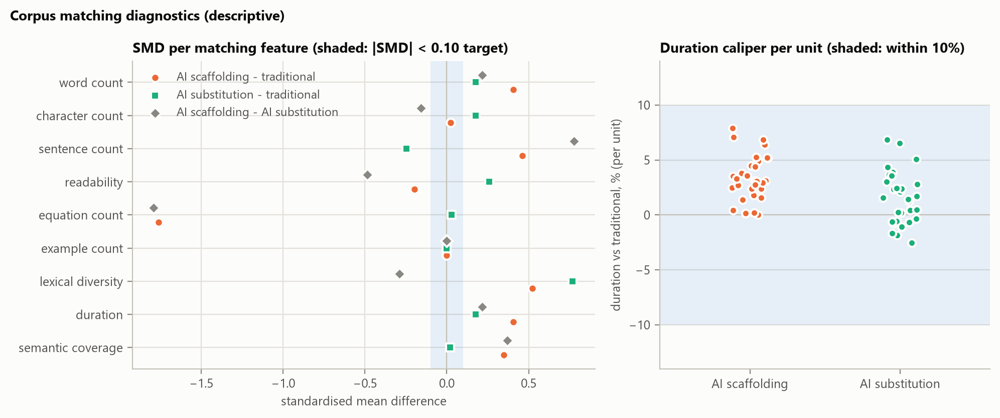

# 3. Methodology

<!-- CLAUDE: 3.1 Design overview and data generation - not drafted yet (see outline.md). -->

## 3.2 Phase I: the matched educational corpus

No corpus of instructional texts matched across traditional, scaffolding and substitution regimes existed, so one
was constructed for this study. It serves two roles. Its lesson texts are the inputs to the encoding model
(Section 3.3), and its problems, distractors and hints define the episodes that the simulated learners complete
(Section 3.4). Both roles require that the three versions of a unit differ in instructional policy and in nothing
the policy does not entail.

### 3.2.1 Curriculum and unit specification

The curriculum comprises 30 units on 15 concepts from core MBA courses: managerial accounting (seven concepts, among
them break-even quantity, operating leverage and relevant cost), corporate finance (four: net present value, payback
period, return on investment and the weighted average cost of capital), pricing (two: markup versus margin and price
elasticity) and marketing analytics (two: customer lifetime value and customer-acquisition-cost payback). Each concept
is taught by two units that apply the same method to a different surface form, so every concept recurs once, and the
second encounter is where the learner's concept-level experience enters the simulated record (Section 3.4). Nine
concepts carry one prerequisite link. Units are ordered with prerequisites first and then by difficulty, which ranges
from 1 to 4 on the brief's five-point scale; target completion times range from five to eight minutes.

The brief specifies 120 units in two domains, Bayesian reasoning and causal inference [@brief2026]. The reduction has
a statistical consequence: every unit-level inference in Phases II to V rests on 30 clusters, which bounds the
precision of the cluster bootstrap in Section 3.3. The change of domain preserves the property that motivated the
brief's choice, since every answer in the MBA units is numerical and can be validated deterministically.
<!-- CLAUDE (Q2): the reasons for the reduction and for the change of domain are not recorded anywhere; state them here. -->

Each unit is a structured record containing a canonical problem, a near-transfer problem with the same structure and
changed quantities, a far-transfer problem with a different surface form and context, a documented misconception, two
distractors, a three-level hint ladder ordered from general to specific, a worked example and a worked solution.
Answers are stored as parameterised expressions and recomputed when the corpus is loaded; a unit whose stored answer
disagrees with its expression is rejected. Each distractor is generated by an explicit rule and re-evaluated in the
same way. In every unit one rule encodes the documented misconception and the other a second, distinct error. In unit
`npv_001`, for example, a project costs EUR 100,000 and returns EUR 72,000 at the end of each of two years at a
required return of 20%: the answer is EUR 10,000, the misconception of summing undiscounted cash flows yields
EUR 44,000, and discounting the two-year total once yields EUR 20,000. Every item is therefore a three-option choice
in which each wrong option corresponds to a named error.

### 3.2.2 Instructional conditions

Each unit exists in three versions, giving 90 lesson texts (Table 1). The versions share the unit record (the problem
and its answer options, the transfer items) and the rule that no help is offered before a first independent attempt.
They differ in the style of the explanation and in the support that follows an error. The traditional version
contains a fixed explanation with one worked example, the unit's three prewritten hints and a worked solution. The
scaffolding version phrases the explanation as guided questions, adds at least one diagnostic question per documented
wrong answer and presents the same hint ladder, but contains no worked solution: withholding the answer until the
learner has attempted the problem is the defining feature of scaffolding [@wood1976] and the operational rule of the
brief. The substitution version walks through the complete solution, the regime in which retrieval and generation are
offloaded to an external aid [@risko2016].

Structure is enforced mechanically. Each version must contain exactly the sections its condition prescribes, in
order; the explanation must contain 250 to 400 words; the problem section must reproduce the canonical problem
verbatim; and the hints must match the unit's ladder. The encoding model reads the full text of each version, whereas
the simulated learner reads only the explanation before its first attempt and receives support turn by turn
thereafter. In the scaffolding and substitution conditions those turns are generated at run time by a language-model
tutor (Section 3.4) and are never seen by the encoding model. The adaptation values in Table 1 are the per-condition
constants that enter the instructional-effectiveness term (eq. 20). They are assumptions, not properties of the
texts, and Section 3.8 treats them as a dimension of the specification curve.

Table: **Table 1.** Instructional conditions and fixed versus varying features

| | Traditional | AI scaffolding | AI substitution |
|---|---|---|---|
| Lesson text | Explanation with one worked example; three hints; worked solution | Explanation as guided questions; diagnostic questions; three hints; no worked solution | Explanation that walks through the complete solution; worked solution |
| Support after a wrong answer | Hint *k*, then answer again or request the next hint | Tutor turn *k*: diagnosis, one question, a level-*k* hint, leakage-checked | One message with the complete solution, then one re-answer |
| Answer provided | After the third hint | After the third tutor turn | After the first wrong answer |
| Adaptation, eq. 20 (assumed) | 0.35 | 0.90 | 0.20 |
| Words, mean | 529.2 | 546.8 | 537.2 |
| Duration at 220 wpm, mean (s) | 144.3 | 149.1 | 146.5 |
| Equations, mean | 9.27 | 5.73 | 9.33 |

*Held fixed across conditions: unit, concept, domain, difficulty, problem, answer options, near- and far-transfer
items, the three-option format and the absence of help before a first attempt. Source: own elaboration; computed from
the 90 primary lesson texts (`outputs/tables/table1_conditions.csv`).*

### 3.2.3 Matching

Each lesson text $s$ is described by the vector of observable, non-pedagogical features specified in the brief,

$$ x_s = [\text{words},\ \text{characters},\ \text{sentences},\ \text{reading level},\ \text{equations},\ \text{examples},\ \text{duration},\ \text{lexical diversity},\ \text{semantic coverage}] \qquad (1) $$

where reading level is the Flesch–Kincaid grade [@kincaid1975], equations are counted as equality signs, lexical
diversity is the type–token ratio, duration is the reading time at 220 words per minute (the presentation rate of the
main encoding specification, Section 3.3), and semantic coverage is defined in Section 3.2.4. Balance on feature $k$
between an AI condition $A$ and the traditional condition $T$ is measured by the standardised mean difference

$$ \text{SMD}_k = \frac{\bar{x}_{k,A} - \bar{x}_{k,T}}{\sqrt{\left(s^2_{k,A} + s^2_{k,T}\right)/2}} \qquad (3) $$

against the conventional target $|\text{SMD}| < 0.10$ [@austin2009], complemented by paired two one-sided tests with
bounds of ±0.10 pooled standard deviations, reported as descriptive diagnostics rather than as evidence of equivalence
[@schuirmann1987; @lakens2017]. Matching is exact on unit, concept, domain, difficulty, modality and answer
correctness, because all three versions derive from one unit record, and caliper-based on duration: every AI version
lies within 10% of its traditional counterpart, with a maximum deviation of 7.9% (Figure 2, right). Duration is a
fixed multiple of word count, so the caliper constrains both. The brief's selection step, which retains the AI version
closest to the traditional text in Mahalanobis distance (eq. 2), was not applied: each condition has a single primary
version edited to the caliper, not a pool of candidates to select from.

*Source: own elaboration; computed from the 90 primary lesson texts (`outputs/tables/corpus_balance.csv`).*

The SMD target is met in all three pairwise comparisons for one of the nine features, example count, which is fixed
at one worked example per text by design (Figure 2, left). The failures have two sources. The first is scale. Texts
vary little across units (the standard deviation of word count is about 44 words), so the scaffolding texts' mean
excess of 17.6 words, 3.3% of the traditional mean, registers as an SMD of 0.41; duration (0.41), sentence count
(0.46), lexical diversity (0.52) and semantic coverage (0.35) exceed the target in the same comparison. Apart from
example count, which is identical by construction, equivalence at the ±0.10 SD margin is supported only for character
count between scaffolding and traditional and for equation count between substitution and traditional (TOST
$p$ = 0.042 and $p$ < 0.001). The second source is structural and cannot be removed by editing. The scaffolding texts
contain no worked solution and therefore 3.5 fewer equations on average (SMD −1.76 against traditional, −1.79 against
substitution), so the scaffolding–traditional contrast is in part a contrast between a text with a worked solution and
a text without one. Section 3.3 carries this into the cortical analysis, where duration, word count and equation count
enter as covariates (falsification criterion F1); because duration is collinear with word count, that covariate block
spans two dimensions rather than three.

### 3.2.4 Content validation

Correctness and leakage are enforced deterministically. The unit's answer must appear in the section where the
condition permits it, the worked solution of the traditional and substitution texts, and in no other section; a
scaffolding text that states the answer anywhere is rejected. Leakage in the lesson texts is therefore zero by
construction, against the brief's tolerance of 2%; the tutor turns generated during the simulation are checked
separately at run time (Section 3.4).

Semantic coverage is the cosine similarity between sentence embeddings (the `all-mpnet-base-v2` model of the
Sentence-Transformers framework [@reimers2019]) of a text's explanation and the unit's reference worked solution. The
acceptance threshold of 0.50 was fixed before any similarity was computed. All 90 primary texts exceed it (minimum
0.53; condition means 0.68 to 0.70), as do all 210 control texts described in Section 3.2.5 (minimum 0.52); the lowest
decile of primaries was listed for manual review. <!-- CLAUDE: confirm whether that review was carried out; if not,
say so here rather than imply it. --> Near duplication across units was screened by the Jaccard similarity of word
5-gram sets [@broder1997] over all 435 pairs of traditional texts, with the threshold of 0.50 fixed before scoring.
The highest value, 0.17, belongs to the two units of one concept (`cac_001` and `cac_002`), as the paired design
implies; no pair was flagged.

Contradiction screening uses a separate judge model, Qwen2.5-3B-Instruct [@qwen2024], distinct from the model used to
draft the texts, as the brief requires (§5.4). <!-- CLAUDE (Q1): name the drafting model and point to the declaration
of assistance. --> A first implementation posed the brief's three questions (factual contradiction, unsupported
assertion, invalid causal statement) in one abstract prompt. It flagged none of the 90 texts and also none of 30 texts
written to be wrong, so its silence carried no information. The check was rebuilt as extraction followed by
comparison: the judge states the final answer a text asserts, and that answer is compared with the unit's reference.
The rebuilt check detects 27 of 30 incorrect-but-fluent texts (sensitivity 0.90) and passes all 60 correct texts in
the two conditions that state an answer (specificity 1.00); the scaffolding texts, which state none, are recorded as
not applicable. It flags none of the 60 primary texts. The two remaining checks, unsupported assertion and causal
language, have no ground truth in the corpus and remain unvalidated. They queued one text (`npv_002`, scaffolding),
whose worked example, reference answer and leakage check were confirmed correct on inspection; their silence on the
remaining texts is not evidence that such errors are absent.

### 3.2.5 Text controls

Two families of control texts were written for the encoding-model analysis only; the simulated learners never read
them. The first contains two stylistic rewordings of every primary text (180 texts, one plainer and one more formal),
which keep the sections, the stated quantities, the canonical problem and the answer placement of the primary, within
the same 10% duration caliper. They implement the brief's stylistic regenerations and support falsification criterion
F2: a condition contrast smaller than the variation across harmless rewordings is not interpreted. The second family
contains 30 incorrect-but-fluent traditional texts that teach the unit's documented misconception as if it were
correct: they never state the correct answer, and their worked solution reaches the misconception's answer. They serve
as a content control for the encoding model (criterion F5) and as the ground truth of the contradiction check above.
All 210 control texts pass the same structural validators as the primaries. Both families were drafted by a language
model rather than by independent human authors, which limits how far they sample the stylistic range of human-written
instruction (Section 5.4). The sentence- and word-shuffled controls, which are derived from the primaries rather than
written, are described with the encoding model in Section 3.3.

<!-- CLAUDE: 3.3-3.9 not drafted yet (see outline.md). -->
