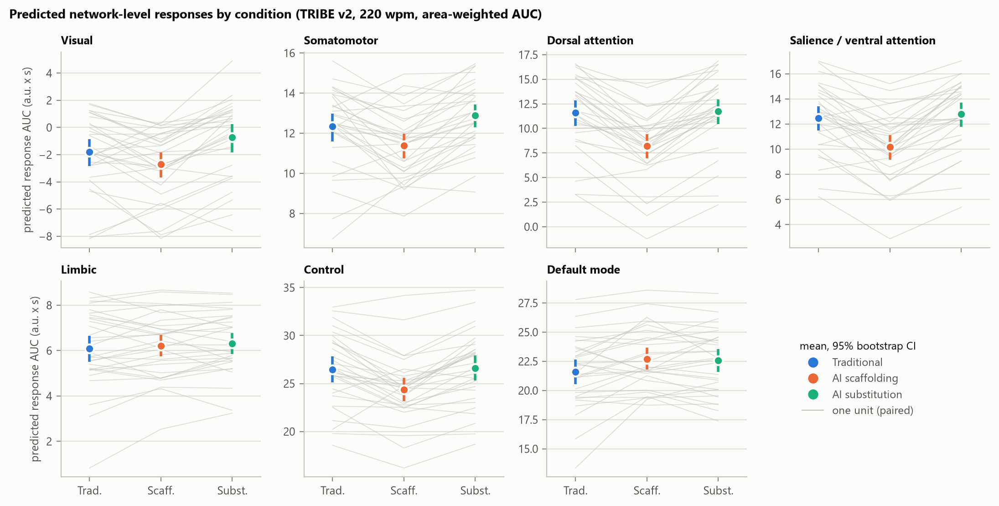
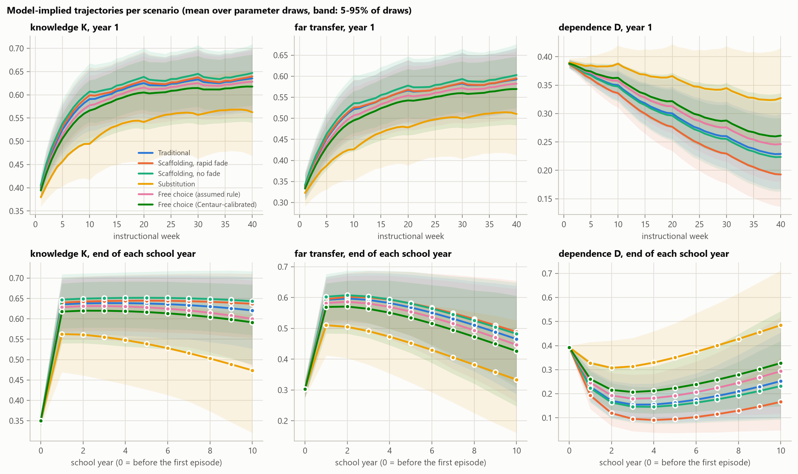
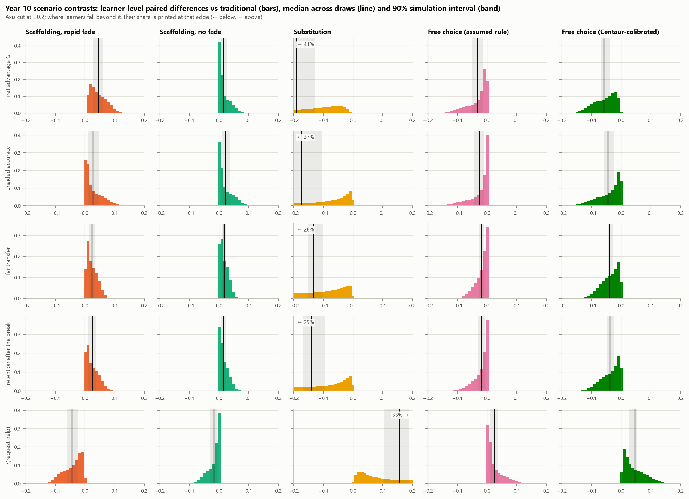
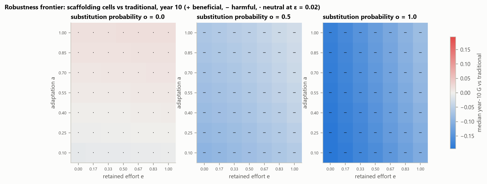
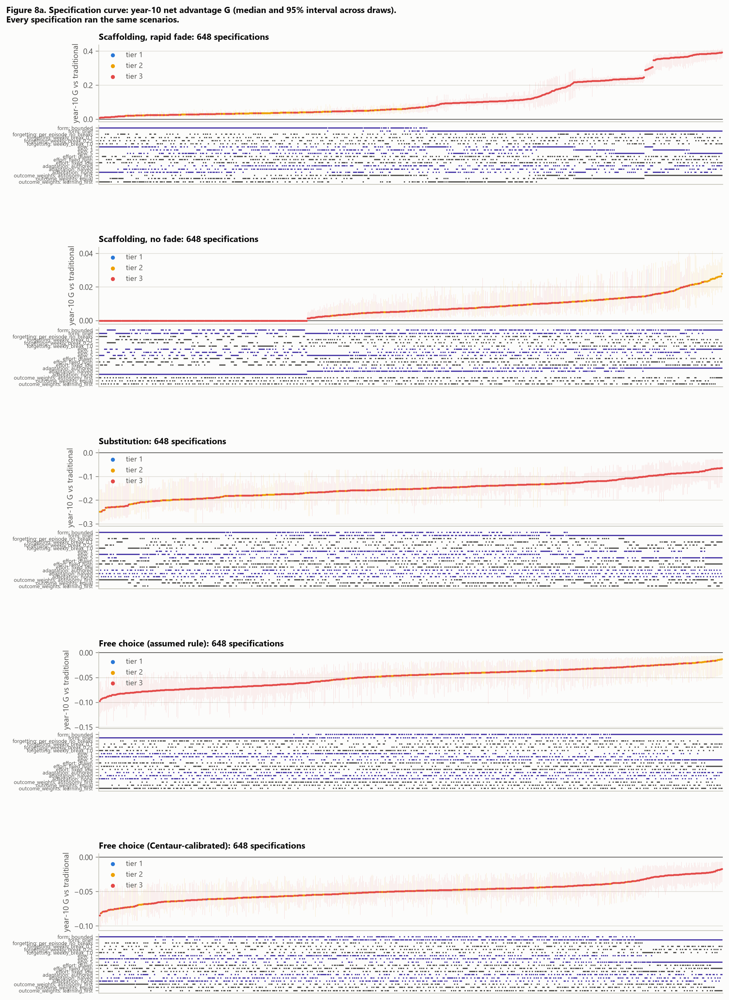

# 4. Results

## 4.1 Immediate predicted cortical contrasts

Figure 3 shows the predicted response of each network, summarised by its area under the curve, for the three
versions of every unit. At the main reading speed, 14 of the 21 network contrasts have 95% intervals that exclude
zero (Table 4). The dominant pattern is a lower predicted response to the scaffolding versions: relative to both other
versions they evoke less in the visual, somatomotor, dorsal-attention, salience/ventral-attention and control
networks, most of all in the dorsal-attention network (−3.37 against traditional instruction, −3.54 against
substitution). Substitution differs less from traditional instruction; its intervals exclude zero only in the visual,
somatomotor and default-mode networks. The mixed model of eq. 42, which treats the units as a sample, gives the same
ordering across networks: −1.20 (95% interval −1.60 to −0.80) for scaffolding and 0.49 (0.09 to 0.89) for
substitution relative to traditional instruction, with each step of difficulty lowering the response by 1.19.

*Source: own elaboration; predicted cortical responses of TRIBE v2 to the 90 lesson texts at 220 words per minute
(`outputs/tables/fig3_network_responses.csv`).*

Three criteria restrict what may be claimed. With duration, word count and equation count as covariates (F1), the
substitution contrasts in the somatomotor and default-mode networks no longer exclude zero, and the default-mode
contrast between scaffolding and traditional instruction reverses its sign, from 1.09 to −1.04. Rewording (F2) is
the binding criterion: across the nine combinations of primary and reworded texts, 15 of the 21 contrasts change sign
or do not exceed twice their standard deviation. They include every contrast between substitution and traditional
instruction and every contrast in the control network, where the rewordings alone vary the scaffolding contrast
with a standard deviation of 1.58 against a primary value of −2.10. The incorrect-but-fluent texts move the control,
default-mode and limbic networks by at least half of their largest condition contrast (F5), networks that rewording
had already excluded. Six contrasts pass all three criteria: scaffolding against both traditional instruction and
substitution in the somatomotor, dorsal-attention and salience/ventral-attention networks, all lower under
scaffolding. Five of the six still exclude zero at 180 and 260 words per minute; the somatomotor contrast with
traditional instruction does not.

Table: **Table 4.** Condition contrasts in the predicted network response (area under the curve, 220 words per minute)

| Network | S − T | U − T | S − U |
|---|---|---|---|
| Visual | −0.90 [−1.54, −0.28]^b^ | 1.07 [0.51, 1.61]^b^ | −1.97 [−2.47, −1.47]^b^ |
| Somatomotor | **−0.95 [−1.52, −0.39]** | 0.55 [0.12, 0.96]^ab^ | **−1.50 [−1.86, −1.15]** |
| Dorsal attention | **−3.37 [−4.15, −2.60]** | 0.17 [−0.49, 0.82]^b^ | **−3.54 [−4.19, −2.92]** |
| Salience / ventral attention | **−2.29 [−2.96, −1.62]** | 0.32 [−0.20, 0.85]^b^ | **−2.61 [−3.12, −2.13]** |
| Limbic | 0.12 [−0.14, 0.38]^bc^ | 0.21 [−0.04, 0.46]^bc^ | −0.09 [−0.29, 0.12]^bc^ |
| Control | −2.10 [−2.86, −1.30]^bc^ | 0.15 [−0.55, 0.95]^bc^ | −2.26 [−2.82, −1.68]^bc^ |
| Default mode | 1.09 [0.46, 1.73]^bc^ | 0.96 [0.32, 1.66]^abc^ | 0.13 [−0.34, 0.62]^bc^ |

*Mean paired difference over the 30 units with its cluster-bootstrap 95% interval (eq. 10–13); S scaffolding,
U substitution, T traditional instruction. Bold: the interval excludes zero and the contrast passes F1, F2 and F5.
^a^ The interval includes zero once duration, word count and equation count are covariates (F1). ^b^ Not robust to
rewording (F2). ^c^ Network in which the incorrect-but-fluent texts reach half of the largest condition contrast (F5).
Source: own elaboration; predicted responses of TRIBE v2 (`outputs/tables/table4_cortical_contrasts.csv`,
`table4_cortical_contrasts_matched_covariates.csv`, `tableS_regeneration_contrasts.csv`,
`tableS_incorrect_control.csv`).*

What the six contrasts measure is limited by the construction of the texts (Section 3.2.3). The scaffolding versions
contain no worked solution and, on average, 3.5 fewer equations. The covariates include the equation count, but no
covariate removes a section that one condition lacks by design, so the surviving contrasts compare a text with
diagnostic questions and no worked solution with texts that have one; they cannot be attributed to scaffolding as an
instructional regime. At the level of parcels, 281, 165 and 353 of the 400 parcels have false-discovery-corrected
q < 0.05 for the three contrasts (Figure S2, Appendix E); these maps were not tested against rewording and are
descriptive. The similarity structure among units is preserved across conditions: the dissimilarity matrices of
eq. 14 correlate at 0.79, 0.82 and 0.78 between pairs of conditions, no permutation of condition labels within
units produced a closer agreement than the observed one, and differentiation between concepts is 0.013 to 0.016 in
all three (Figure 4, Appendix E). The predicted patterns of any two units correlate at 0.87 or more, so the
geometry the analysis compares is compressed.

## 4.2 One term of simulated learning

Phase III gives the contrasts between the conditions for the same simulated learners over one term. At the final
checkpoint of the population run (1,667 learners, medium setting), scaffolding exceeds traditional instruction by
small margins in unaided accuracy (0.008, 95% interval 0.006 to 0.011), far transfer (0.010, 0.005 to 0.016) and
retention (0.010, 0.005 to 0.015). Substitution falls below it in all three (−0.075, −0.105 and −0.096) and ends
the term with lower knowledge (−0.074), memory (−0.109) and reasoning (−0.059) and higher dependence (0.066). Free
choice lies between the two (−0.015 in unaided accuracy, −0.019 in far transfer). The ordering, scaffolding above
traditional instruction above free choice above substitution, holds for unaided accuracy and far transfer in all
three parameter settings (Figure S3, Appendix E). Two features of these numbers limit their reading. A checkpoint
tests three trained items and two items each of near and far transfer, so most paired differences are exactly zero (98% of learners tie in
unaided accuracy between scaffolding and traditional instruction) and the probability of superiority is
uninformative here. And the substitution protocol offers no help to request, so its request rate is zero by
construction.

The hybrid engine was compared with the logistic engine on the same 40 learners over 30 episodes (Figure S1,
Appendix E). Delegating the choices to Centaur raised help requests by 0.094 per episode under scaffolding (95%
interval 0.040 to 0.152) and by 0.071 under traditional instruction (0.006 to 0.135), and lowered $C$ by 0.069 to
0.089 in every arm, the consequence of confidence ratings that follow the record (Section 3.4). It shifted the
end-of-run states by at most 0.011 (knowledge under free choice, 95% interval −0.018 to −0.004) and left every
checkpoint accuracy within 0.025 of the logistic engine, with intervals that include zero. The contrasts between arms
in knowledge, memory, reasoning, dependence and first-attempt accuracy have the same sign under both engines and
differ by less than 0.01. The engines diverge in free choice, where Centaur chose substitution in 44% of episodes,
traditional instruction in 31% and scaffolding in 25%, against 31%, 39% and 30% under the assumed softmax on the same
learners; this divergence is why a rule fitted to Centaur's choices was carried into Phase V.

## 4.3 Ten-year scenario contrasts

Figure 5 shows the mean trajectories. Knowledge rises during the first school year to between 0.62 and 0.65 in
every scenario except substitution (0.56), in line with the plateau of eq. 21 discussed in Section 3.5, and over the
next nine years falls by less than 0.03 in the other scenarios and by 0.09 under substitution. As the difficulty term
rises, far-transfer accuracy declines in every scenario after the second year (after the first under substitution),
and dependence, after falling for two to four years, rises again, most steeply under substitution (from 0.31 in year
2 to 0.48 in year 10).

*Source: own elaboration; model-implied output of the Phase V main run, 500 parameter draws of 2,000 learners
(`outputs/tables/fig5_trajectories_v_main.csv`).*

At year 10 (Table 5), substitution has the largest contrast: $G$ is −0.191 (95% simulation interval −0.233 to
−0.118), with unaided accuracy lower by 0.175, far transfer by 0.134 and retention by 0.140, and the probability of
requesting help higher by 0.157. Both free-choice scenarios are negative, the rule fitted to Centaur's choices
(−0.059) nearly twice as much as the assumed one (−0.032). Both scaffolding scenarios are positive, rapid fading
(0.045) more than no fading (0.015). With $\varepsilon = 0.02$, rapid fading is beneficial, substitution and both
free-choice scenarios are harmful, and scaffolding without fading is neutral. The contrasts grow with time:
substitution's $G$ is −0.075 at year 1 and −0.144 at year 5, rapid fading's 0.008 and 0.028. The components differ.
Rapid fading's advantage lies in reasoning (0.101) and dependence (−0.088) rather than knowledge (0.014), whereas
substitution loses on all four states (knowledge −0.146, memory −0.090, reasoning −0.278, dependence 0.240).

Table: **Table 5.** Year-10 scenario contrasts against traditional instruction

| Scenario | $G$ | Unaided accuracy | Far transfer | Retention | P(help request) |
|---|---|---|---|---|---|
| Scaffolding, rapid fading | 0.045 [0.024, 0.064] | 0.027 [0.010, 0.048] | 0.023 [0.011, 0.036] | 0.024 [0.011, 0.039] | −0.044 [−0.062, −0.019] |
| Scaffolding, no fading | 0.015 [0.005, 0.030] | 0.020 [0.007, 0.038] | 0.017 [0.009, 0.024] | 0.015 [0.006, 0.026] | −0.017 [−0.032, −0.006] |
| Substitution | −0.191 [−0.233, −0.118] | −0.175 [−0.217, −0.094] | −0.134 [−0.156, −0.096] | −0.140 [−0.171, −0.085] | 0.157 [0.089, 0.193] |
| Free choice, assumed rule | −0.032 [−0.057, −0.012] | −0.026 [−0.047, −0.008] | −0.019 [−0.029, −0.008] | −0.020 [−0.034, −0.007] | 0.025 [0.008, 0.039] |
| Free choice, fitted rule | −0.059 [−0.071, −0.035] | −0.046 [−0.059, −0.023] | −0.040 [−0.047, −0.028] | −0.039 [−0.048, −0.023] | 0.046 [0.024, 0.055] |

*Median across 500 parameter draws of the mean paired difference from traditional instruction (eq. 37), with the
95% simulation interval across draws; $G$ by eq. 39 with equal weights. Source: own elaboration; model-implied output
of the Phase V main run (`outputs/tables/table5_scenario_contrasts_v_main.csv`).*

The contrast holds for almost every simulated learner, not only on average (Figure 6). The probability of
superiority in $G$ is 1.000 for both scaffolding scenarios and at most 0.004 for the other three. Under substitution
the paired differences of individual learners in $G$ spread from about −0.43 to −0.01 (1st and 99th percentiles, to
the 0.01 resolution of the stored histograms), whereas under rapid fading they lie between about 0.01 and 0.11. With one or
five episodes a week instead of three (200 draws of 1,000 learners), the year-10 $G$ of the four AI scenarios run at
those exposures, all but the fitted free-choice rule, keeps its sign, with intervals that exclude zero.

*Source: own elaboration; model-implied output of the Phase V main run, learner-level paired differences pooled over
500 parameter draws (`data/processed/phase5/v_main/contrast_hist`, `outputs/tables/table5_scenario_contrasts_v_main.csv`).*

## 4.4 Frontier and tipping points

The phase diagram (Figure 7a) replaces the named scenarios by an AI protocol whose adaptation $a$, retained effort
$e$ and probability of substitution $o$ vary continuously. Without substitution ($o = 0$) all 49 cells are neutral,
with medians of $G$ between −0.009 and 0.020; $G$ changes sign between $a = 0.25$ and $a = 0.40$, where the AI
protocol's adaptation passes the 0.35 assumed for traditional instruction, and retained effort moves it by less than
0.004. With $o = 0.5$ or $o = 1$ all 98 cells are harmful, whatever the adaptation and retained effort. Along the
tipping lines, $G$ keeps its sign over the whole range of retained effort, of fading and of the forgetting multiplier
in all 200 draws. It turns negative as substitution is mixed into the AI episodes, at $o = 0.097$ (95% interval 0.058
to 0.144): in the model, once about one AI episode in ten gives the answer instead of scaffolding, the scaffolding
scenario falls below traditional instruction.

*Source: own elaboration; model-implied output of the Phase V frontier run, 100 parameter draws of 300 learners
(`outputs/tables/fig7a_phase_diagram.csv`, `tableS_tipping_points.csv`).*

## 4.5 Mechanisms

Holding one mediator at the value the same learner had under traditional instruction shows where each contrast
passes (50 draws of 500 learners). For substitution, holding effort removes 0.97 of the knowledge contrast and 0.51
of $G$, holding effectiveness 0.17 and 0.07, and holding dependence in the decision rules nothing, since substitution
offers no help to request. For scaffolding without fading, holding effectiveness removes the whole contrast in every
behavioural outcome (a contribution of 1.00), which is the consequence of adaptation being the only term separating it from
traditional instruction. For rapid fading, no mediator accounts for more than 0.22 of $G$ (effectiveness 0.22,
effort 0.12, dependence 0.08). The rest passes through the terms by which withdrawal enters the updates of reasoning
and dependence directly (support used, offloading and unaided success, eq. 23′ and 25′), which the decomposition
does not hold. Under free choice the contributions fall outside the interval from 0 to 1 (1.25 for effort on
knowledge, −0.21 for effectiveness), a reminder that the decomposition is not additive.

## 4.6 Robustness and falsification

The specification curve (Figure 8a) re-estimates the year-10 $G$ of each scenario in 648 specifications. Four of the
five AI scenarios keep the sign of the median in all of them with no 95% interval including zero: substitution
(medians from −0.248 to −0.064), both free-choice rules and rapid fading (0.009 to 0.393) (Table 6). Scaffolding
without fading does not. Its 216 failures are exactly the specifications in which adaptation is set equal across
the three protocols; in every one of them the median and both bounds of the interval are 0, because with equal
adaptation the scaffolding protocol without fading is numerically the traditional one. In the other 432
specifications its interval excludes zero, at medians no larger than 0.028. Its advantage is therefore the assumed
adaptation constant and nothing else, whereas rapid fading stays positive at equal adaptation (medians from 0.009),
because withdrawing support changes the updates of reasoning and dependence (Section 4.5).

Table: **Table 6.** Sign stability of year-10 $G$ across the specification curve

| Scenario | Median sign constant | Intervals including 0 | Range of medians | Direction |
|---|---|---|---|---|
| Scaffolding, rapid fading | Yes | 0 of 648 | 0.009 to 0.393 | Robust |
| Scaffolding, no fading | No | 216 of 648 | 0.000 to 0.028 | Not robust: fails at equal adaptation |
| Substitution | Yes | 0 of 648 | −0.248 to −0.064 | Robust |
| Free choice, assumed rule | Yes | 0 of 648 | −0.097 to −0.013 | Robust |
| Free choice, fitted rule | Yes | 0 of 648 | −0.084 to −0.017 | Robust |

*Each specification: 50 parameter draws of 300 learners; median and 95% interval across draws. Source: own
elaboration; model-implied output of the 216 specification-curve runs (`outputs/tables/tableS_sign_stability.csv`).*

*Source: own elaboration; model-implied output of the 216 specification-curve runs, each of 50 parameter draws of
300 learners (`outputs/tables/fig8a_spec_curve_G.csv`).*

The variance decomposition (eq. 41), over the four AI scenarios of the replicate runs, attributes 68.3% of the
variance of year-10 $G$ to the scenario, 28.9% to differences between learners, 1.6% to the parameter draws and
1.3% to behavioural randomness; plasticity and stimulus contribute nothing, since $G$ has no neural term. The
behavioural controls behave as required: with effort insensitive to behaviour the substitution contrast in knowledge
falls from 0.146 to 0.011, and none of 1,000 random sign flips of the paired differences produced a contrast as
extreme as the observed year-10 contrast in unaided accuracy, far transfer or retention of any scenario.

Table 7 collects the falsification verdicts. They withdraw claims in three places. Beyond the cortical contrasts of
Section 4.1 (F1, F2, F5) and the neural contrasts of Section 4.7 (F3, F5), F4 withholds a claim for scaffolding with
rapid fading: in its median draw 12.1% of learners end within 0.01 of a bound; in the stored subsample of learners,
11.7% have dependence within 0.01 of zero and 1.7% reasoning within 0.01 of one. Its direction survives the specification curve,
but the size of its year-10 contrast is partly produced by the floor of the dependence scale. The only criterion
that allows a claim without exception is F6: in all six comparisons, the year-10 difference between a scaffolding
scenario and substitution in unaided accuracy, far transfer and retention has an interval that excludes zero.

Table: **Table 7.** Falsification verdicts

| Criterion | Result | Verdict |
|---|---|---|
| F1 Matching | 2 of 21 network contrasts lose significance with covariates (default mode and somatomotor, U − T) | No claim for those 2 |
| F2 Harmless rewording | 15 of 21 network contrasts change sign or fall below twice the rewording spread | No claim for those 15 |
| F3 Plasticity model | Sign of the median year-10 neural contrast differs across mechanisms in 4 of 35 scenario-networks | No claim for those 4 |
| F4 Parameter bounds | 12.1% of learners near a bound in the median draw of rapid fading; no sign change under uniform draws | No claim for scaffolding with rapid fading |
| F5 Negative controls | Permuted condition labels reach half the contrast in 8 of 28 scenario-networks; incorrect-but-fluent texts in 3 of 7 networks | No claim for those |
| F6 Indistinguishability | All 6 scaffolding − substitution differences exclude zero | Claim allowed |

*Source: own elaboration (`outputs/tables/table6_falsification.csv`).*

## 4.7 Predicted neural trajectories (exploratory)

Under mechanism D, the model-implied neural contrasts at year 10 are large in standardised terms: both scaffolding
scenarios have medians of $d$ between −6.0 and −4.8 in five networks and about 4.7 in the default-mode network. They
are large because every learner receives the same texts, so the paired differences vary little across learners; $d$
measures how consistently learners differ, not by how much. Two results prevent any claim about their direction. The
contrasts are built from the predicted responses of Section 4.1, and F2 allowed a claim for only three networks and
for none of the contrasts between substitution and traditional instruction. And the one outcome followed through the
specification curve, the control-network contrast between substitution and traditional instruction, has a positive
median in 59.2% of its 62,208 specifications and a negative one in the rest; in the main run, at the main
specification, its median is −0.13 (95% interval −0.89 to 0.78). Its sign depends mostly on how the predicted response is
summarised and read: the median is positive in 89.5% of specifications at 180 words per minute and in 36.9% at 260,
and in 97.6% with the peak as the response metric against 30.2% with the mean (Figure 8b, Appendix E). The adaptation
constant, by contrast, does not matter for it (59.0%, 59.2% and 59.3% positive at its three levels). Consistently,
the variance decomposition attributes 40.6% of the variance of this contrast to the plasticity settings and 33.1% to
the scenario. In the neural diagram (Figure 7b, Appendix E), the offloading weight $\lambda_O$ moves the contrast of
substitution more than the half-life of the neural state does in six of the seven networks. These trajectories are model-implied consequences of
the assumptions of Phase IV and are reported as exploratory.
