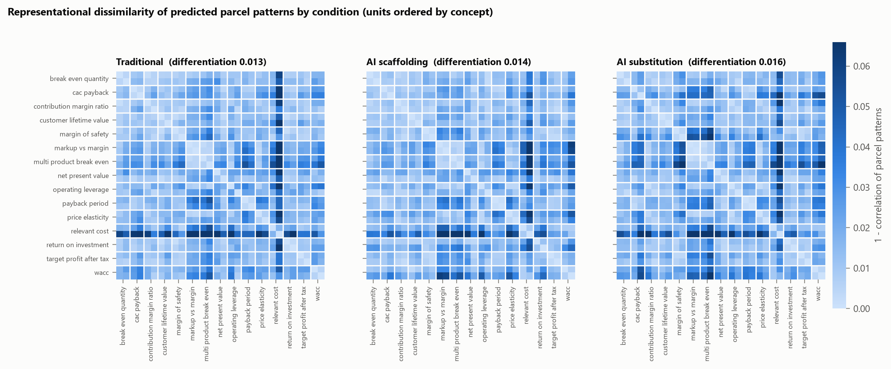
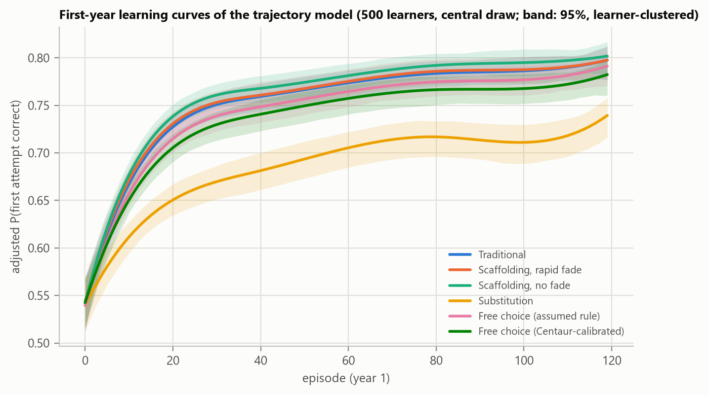
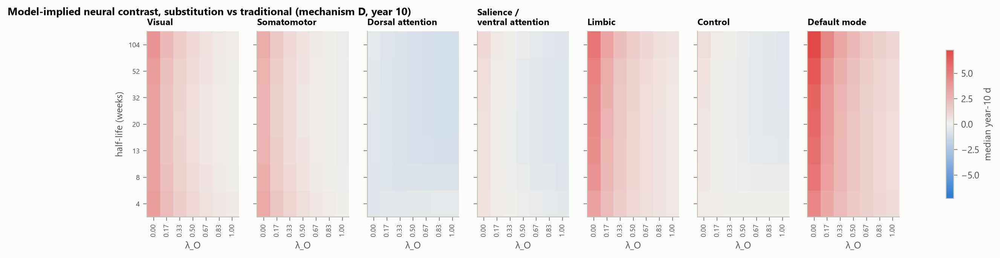
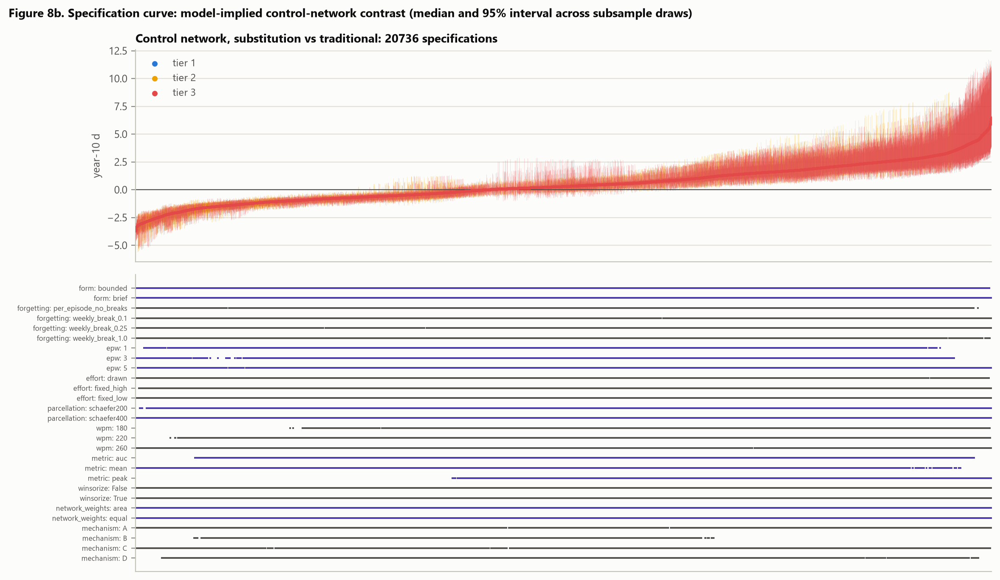
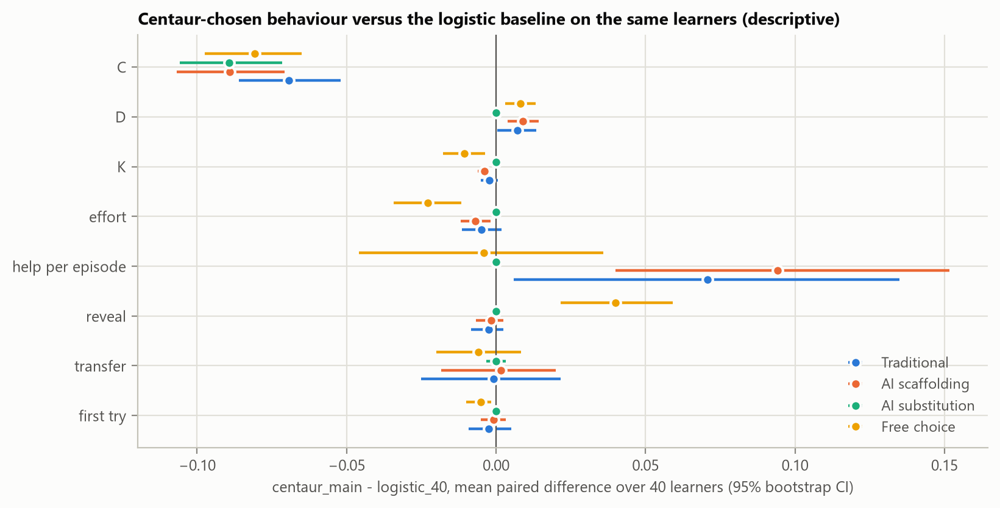
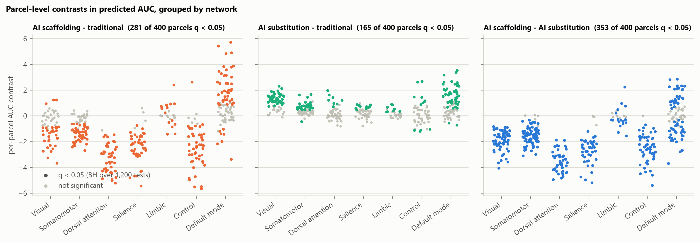
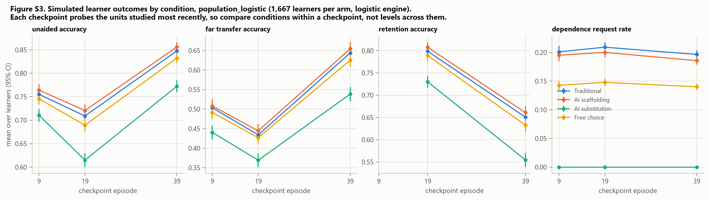

# Appendices

## Appendix A. Corpus validation details

The 30 units cover seven concepts in managerial accounting (among them break-even quantity, operating leverage and
relevant cost), four in corporate finance (net present value, payback period, return on investment and the weighted
average cost of capital), two in pricing (markup versus margin and price elasticity) and two in marketing analytics
(customer lifetime value and customer-acquisition-cost payback). Nine concepts carry one prerequisite link. Difficulty
ranges from 1 to 4 on a five-point scale, and target completion times from five to eight minutes. The explanation of
every lesson text has 250 to 400 words. In unit `npv_001`, for example, a project costs EUR 100,000 and returns
EUR 72,000 at the end of each of two years at a required return of 20%: the answer is EUR 10,000, the misconception of
summing undiscounted cash flows yields EUR 44,000, and discounting the two-year total once yields EUR 20,000.

### A.1 Matching features and equivalence tests

Each lesson text $s$ is described by a vector of nine observable, non-pedagogical features,

$$ x_s = \left(x_{s,1}, \dots, x_{s,9}\right), \qquad (1) $$

the numbers of words, characters, sentences, equations (counted as equality signs) and worked examples, the
Flesch–Kincaid grade [@kincaid1975], the duration at 220 words per minute, the type–token ratio and the semantic
coverage of Section 3.2.4. Balance on feature $k$ between an AI condition $A$ and the traditional condition $T$ is the
standardised mean difference

$$ \text{SMD}_k = \frac{\bar{x}_{k,A} - \bar{x}_{k,T}}{\sqrt{\left(s^2_{k,A} + s^2_{k,T}\right)/2}}, \qquad (3) $$

against the target $|\text{SMD}| < 0.10$ [@austin2009]. Matching is exact on unit, concept, domain, difficulty,
modality and answer correctness, and caliper-based on duration: every AI version lies within 10% of its traditional
counterpart, with a maximum deviation of 7.9%. Each AI version shares a median of 82% of its sentences (range 79–84%)
verbatim with the traditional text.

The two sources of imbalance named in Section 3.2.3 have the following size. Texts vary little across units (the
standard deviation of word count is about 44 words), so the scaffolding texts' mean excess of 17.6 words, 3.3% of the
traditional mean, registers as an SMD of 0.41; duration (0.41), sentence count (0.46), lexical diversity (0.52) and
semantic coverage (0.35) exceed the target in the same comparison. The scaffolding texts contain on average 3.5 fewer
equations (SMD −1.76 against traditional, −1.79 against substitution). Because duration is a fixed multiple of word
count, the covariate block of the cortical analysis spans two dimensions rather than three.

Table A1 complements Figure 2 with the paired two one-sided tests (TOST) of Section 3.2.3. For each feature and pair
of conditions, the test asks whether the mean paired difference over the 30 units lies within ±0.10 pooled standard
deviations; a small *p* supports equivalence at that margin. The tests are descriptive diagnostics: with 30 units and
little variation across them, a large *p* reflects low power as much as imbalance, and a small *p* does not establish
that two sets of texts are interchangeable. Apart from example count, which is identical by construction and for
which the margin is therefore zero, equivalence at the 0.05 level is supported in two of the remaining 24 comparisons:
character count between scaffolding and traditional (*p* = 0.042) and equation count between substitution and
traditional (*p* < 0.001).

Table: **Table A1.** Standardised mean differences and paired equivalence tests, by feature and pair of conditions

| Feature | SMD S–T | TOST *p* S–T | SMD U–T | TOST *p* U–T | SMD S–U | TOST *p* S–U |
|---|---|---|---|---|---|---|
| Words | 0.41 | 1.000 | 0.18 | 0.933 | 0.22 | 0.980 |
| Characters | 0.02 | 0.042 | 0.18 | 0.930 | −0.16 | 0.861 |
| Sentences | 0.46 | 1.000 | −0.25 | 0.987 | 0.78 | 1.000 |
| Reading level | −0.20 | 0.928 | 0.26 | 0.997 | −0.48 | 1.000 |
| Equations | −1.76 | 1.000 | 0.03 | < 0.001 | −1.79 | 1.000 |
| Examples | 0.00 | 1.000 | 0.00 | 1.000 | 0.00 | 1.000 |
| Lexical diversity | 0.52 | 1.000 | 0.77 | 1.000 | −0.29 | 0.968 |
| Duration | 0.41 | 1.000 | 0.18 | 0.935 | 0.22 | 0.980 |
| Semantic coverage | 0.35 | 0.976 | 0.02 | 0.247 | 0.37 | 1.000 |

*S: AI scaffolding; U: AI substitution; T: traditional. Source: own elaboration; computed from the 90 primary lesson
texts (`outputs/tables/corpus_balance.csv`).*

### A.2 Semantic coverage, its manual review and the duplicate screen

Semantic coverage is the cosine similarity between sentence embeddings (the `all-mpnet-base-v2` model of the
Sentence-Transformers framework [@reimers2019]) of a text's explanation and the unit's reference worked solution. The
acceptance threshold of 0.50 was fixed before any similarity was computed. All 90 primary texts exceed it (minimum
0.53; condition means 0.68 to 0.70), as do all 210 control texts (minimum 0.52). Near duplication across units was
screened by the Jaccard similarity of word 5-gram sets [@broder1997] over all 435 pairs of traditional texts, with a
threshold of 0.50 fixed before scoring; no pair was flagged.

The nine primary texts in the lowest decile of semantic coverage (Section 3.2.4) are listed in Table A2. All exceed
the acceptance threshold of 0.50. The review asked whether each explanation teaches the method that its unit's
reference worked solution applies, irrespective of wording.

Table: **Table A2.** Primary texts in the lowest decile of semantic coverage

| Text | Unit | Condition | Cosine |
|---|---|---|---|
| 1 | `pbp_002` | Traditional | 0.529 |
| 2 | `roi_002` | Traditional | 0.541 |
| 3 | `cm_001` | Traditional | 0.565 |
| 4 | `pbp_002` | AI substitution | 0.589 |
| 5 | `ltv_002` | AI substitution | 0.589 |
| 6 | `cac_002` | AI substitution | 0.595 |
| 7 | `ltv_002` | AI scaffolding | 0.600 |
| 8 | `pbp_002` | AI scaffolding | 0.601 |
| 9 | `ltv_002` | Traditional | 0.601 |

*Cosine similarity between the text's explanation and the unit's reference worked solution (`all-mpnet-base-v2`).
Source: own elaboration (`outputs/tables/tableS_semantic_coverage_review.csv`).*

Two features of the list bear on what the review could find. First, the scores are not extreme: averaged over the three conditions, unit coverage runs from 0.573
(`pbp_002`) to 0.786 (`dol_002`), so the lowest decile sits inside a narrow band well above the threshold of 0.50.
Second, six of the nine texts belong to two units, `pbp_002` and `ltv_002`, each appearing in all three conditions,
which locates whatever depresses the score in the unit rather than in an individual lesson. Five surface features
were tested as explanations of the ordering and none accounts for it: over the 30 units, coverage is uncorrelated
with the length of the reference worked solution (*r* = +0.30, *p* = 0.11) and with its density of numerals
(*r* = +0.27, *p* = 0.16); over the 90 texts, it is uncorrelated with the length of the explanation (*r* = +0.13,
*p* = 0.22), with its density of numerals (*r* = +0.05, *p* = 0.65) and with its equation count (*r* = −0.06,
*p* = 0.59), where length is counted in words and density as numerals per word. The first two also point the opposite way to the conjecture that a terse numeric solution depresses
similarity. What remains is the vocabulary a lesson happens to share with its reference solution, which is a
property of the measure rather than of the instruction: the threshold screens for topical relatedness and does not
establish that a lesson covers the method its reference solution applies. Reading the texts is therefore the only
way to settle the question.

Each of the nine texts was read against its unit's reference worked solution with one question: could a student who
had read only the explanation carry out the steps of that solution? For all nine the answer is yes. Each explanation
states the formula its reference solution applies and names the documented misconception as the error to avoid. The
three texts of a unit share all but three sentences of their explanation (Section 3.2.2), which is why `pbp_002` and
`ltv_002` appear in all three conditions. The reading was done once, by the author, who helped write the units and
knew the scores, so it is not an independent check: it establishes that the method is present in each text, not how
effectively the text teaches it.

### A.3 Construction and validation of the contradiction check

The contradiction check of Section 3.2.4 was specified as a screen that routes texts to manual review, never as an
acceptance criterion, and its output was used only after the check had been shown to detect texts known to be wrong.
Every reply was cached with the text and prompt that produced it, so that a change of prompt invalidates earlier
verdicts rather than reusing them, and a reply that could not be parsed was queued for review rather than passed.

**First version.** The judge model (Qwen2.5-3B-Instruct [@qwen2024], served locally) received each text with the
unit's reference answer and was asked the three questions (contradiction, unsupported assertion, causal claim) in
one prompt, in abstract form. It answered "no" to every question for all 90 primary texts. Applied to the 30
incorrect-but-fluent texts, it also answered "no" in every case, including a text stating 2,400 units where the
reference answer given in the same prompt was 6,000. A screen that never fires cannot distinguish a clean corpus from
a failure to detect, so these verdicts were discarded.

**Second version.** Two changes were made, each tested before the full pass. First, the contradiction question was
posed as extraction followed by comparison: the judge reports the final numerical answer the text arrives at and
whether it matches the reference. On a probe of four incorrect and four correct texts it classified all eight
correctly. Second, the check was made condition-aware. The scaffolding texts contain no final answer by construction;
asked anyway, the judge read off another number (for `be_001`, the misconception's 2,400 units quoted in a warning),
and all six scaffolding texts in the probe were returned as contradictions, against none in the other two
conditions. The check is therefore recorded as not applicable to scaffolding texts, neither as a pass nor as a
failure. The unsupported-assertion and causal-claim questions were posed in a separate prompt that supplies the
unit's documented misconception, so that a text warning against the misconception is not read as asserting it.

**A validation set for the other two questions.** The corpus holds texts known to state a wrong answer, which is
what validates the contradiction check, but none known to contain an unsupported assertion or an unlicensed causal
claim. Ninety were therefore written: for each of the 30 units, its traditional lesson with one sentence appended,
of one of three kinds. An *unsupported* sentence asserts a quantity or fact about the problem's scenario that the
unit never states and that cannot be derived from it, such as "The hotel also expects the new kitchen to cut its
energy bill by EUR 2,000 a year." A *causal* sentence asserts a relation the material does not license, such as
"A shorter payback period causes equipment to break down less often." A *background* sentence states standard domain
knowledge that a lesson may legitimately assert, such as "Depreciation is an accounting allocation of a cost that
has already been paid, not a payment made in the year it is charged." The third kind is the negative control, and it
matters because the one primary the judge ever flagged was flagged for a sentence of exactly that character. Each
probe is its primary text plus that one sentence, checked mechanically, so a verdict is attributable to the sentence
and to nothing else.

**Result.** Table A3 reports both blocks. The contradiction check performs as Section 3.2.4 states. The other two
questions flagged none of the 90 probes: neither the 30 carrying an unsupported assertion nor the 30 carrying an
unlicensed causal claim, a sensitivity of 0.00 in each case. Their perfect specificity on the background probes is
vacuous, since they flag nothing at all. As posed, the two questions are therefore not merely unvalidated but
inoperative, and the single primary they had flagged is withdrawn as a finding. The pattern repeats that of the
discarded first version, and the cause is plausibly the same: asked in the abstract whether a text contains a fault
of a stated kind, this model answers no. The contradiction check works because it was reposed as a concrete task,
reading off the final answer and comparing it; reposing these two in the same way is the obvious next step, which
this study did not take. The one text flagged by the unvalidated questions (`npv_002`, scaffolding) was returned
with an affirmative verdict and no reason. A check of its worked example, reference answer and leakage against the
unit record found no error, and the author, reading the whole text for any statement that the unit does not support
or that is false, found none. The flag was therefore a false positive, and the text was not changed.

Table: **Table A3.** The content screen: what was validated, and what each check found

| Question | Standing | Quantity | Texts | Value |
|---|---|---|---|---|
| Contradiction | Validated | sensitivity: incorrect-but-fluent texts flagged | 30 | 0.90 |
| Contradiction | Validated | specificity: correct texts NOT flagged | 60 | 1.00 |
| Unsupported assertion | Validated | sensitivity: probes carrying that fault flagged | 30 | 0.00 |
| Causal claim | Validated | sensitivity: probes carrying that fault flagged | 30 | 0.00 |
| Both of the above | Validated | specificity: standard background NOT flagged | 30 | 1.00 |
| Contradiction | Validated | primaries flagged | 60 | 0 |
| Unsupported assertion | Invalid | primaries flagged | 90 | 1 |
| Causal claim | Invalid | primaries flagged | 90 | 0 |
| Any check | Screen | primaries sent to manual review | 90 | 1 |

*Sensitivity and specificity are shares; findings are counts of texts. Source: own elaboration
(`outputs/tables/tableS_contradiction_judge.csv`).*

## Appendix B. The encoding-model run

### B.1 Configuration and checks

TRIBE v2 was installed from its public repository at commit `af58661` (the main branch of 23 June 2026), and its
checkpoint (`facebook/tribev2`) was verified against the SHA-256 hash published on the model hub. The released
configuration was kept except for the batch size, the number of data-loading workers and the precision of the text
encoder (16-bit floating point). Text features come from Llama-3.2-3B at relative depths 0.5, 0.75 and 1.0 of the
network, sampled at 2 Hz, and the network that maps them onto the cortical surface has 177.2 million parameters. The
run used one NVIDIA L4 GPU in Google Colab: 2.6 hours for the 90 primaries at 220 words per minute, less than 0.1
hours for the other two reading speeds, which reuse the cached text features, 5.1 hours for the 180 shuffled
controls and 5.4 hours for the 210 written controls of Section 3.2.5.

Three checks accompanied the run. First, before any lesson text, the text example distributed with the model was
run through the pipeline and returned a finite prediction of 26 time points by 20,484 vertices; the release provides
no reference output, so the check establishes that the installed pipeline runs end to end, not that it reproduces
published values. Second, one text (`be_001`, traditional) was predicted twice, and the two predictions differ by at
most 7.1 × 10⁻⁴ at any vertex and second, an effect of the reduced precision. Third, every word of every text reached
the model at all three reading speeds, and no prediction failed.

### B.2 Metric definitions

Table: **Table B1.** Metrics of the predicted cortical response

| Metric | Level | Definition |
|------------------|----------------|------------------------------------------------------------------|
| Mean | Parcel, network | Mean of $B$ over the reading window |
| Peak | Parcel, network | Maximum of $B$ after a centred three-second moving average |
| Time to peak | Parcel, network | Second at which the smoothed $B$ reaches its maximum |
| AUC | Parcel, network | Trapezoidal integral of $B$ over the reading window (eq. 8) |
| Sustained engagement | Parcel, network | Share of seconds in which $B$ exceeds the median of all the text's values at that level, an assumed baseline |
| Dispersion | Text | Variance across parcels of the window-mean pattern $\bar b_s$ |
| Entropy | Text | Normalised entropy of the positive part of $\bar b_s$ (eq. 9) |
| Integration | Text | Mean pairwise Pearson correlation of the seven network time courses |

*$B$ is the predicted BOLD response in arbitrary units, one value per second of reading; none of these metrics is a
measured response. Source: own elaboration; definitions as implemented in `src/neurotutorsim/tribe.py`.*

The entropy of text $s$ is computed on the positive part of its window-mean pattern over the $P = 400$ parcels,

$$ H_s = -\frac{1}{\ln P} \sum_{p=1}^{P} q_{s,p} \ln q_{s,p}, \qquad q_{s,p} = \frac{\max\left(\bar b_{s,p}, 0\right)}{\sum_{p'} \max\left(\bar b_{s,p'}, 0\right)}, \qquad (9) $$

and equals 1 when that part is spread evenly over the parcels and 0 when it is concentrated in one.

### B.3 Timing, aggregation, contrasts and controls

**Timing.** In the released pipeline, the onsets of words presented as text come from synthesised speech. Here each
text is read at a fixed rate of $r$ words per minute, so that its $j$-th word has onset

$$ t_j = \frac{60\,(j-1)}{r} \qquad (4) $$

seconds and lasts $60/r$ seconds. At 220 words per minute the texts last 132 to 188 seconds, and all 53,284 words
reach the model.

**Aggregation.** Let $B_{s,v}(t)$ be the predicted response to text $s$ at vertex $v$ of the 20,484 vertices of the
fsaverage5 surface and second $t = 1, \dots, T_s$. Each parcel $p$ takes the mean over its vertices $V_p$, and each
network $n$ the mean of its parcels weighted by their surface areas $a_p$,

$$ B_{s,p}(t) = \frac{1}{|V_p|} \sum_{v \in V_p} B_{s,v}(t), \qquad (6) $$

$$ B_{s,n}(t) = \frac{\sum_{p \in n} a_p\, B_{s,p}(t)}{\sum_{p \in n} a_p}. \qquad (7) $$

Equal weights and a 200-parcel version of the atlas are robustness variants. The area under the curve of parcel or
network $k$ is

$$ \text{AUC}_{s,k} = \sum_{t=1}^{T_s-1} \frac{B_{s,k}(t) + B_{s,k}(t+1)}{2}\,\Delta t, \qquad \Delta t = 1\ \text{s}. \qquad (8) $$

**Contrasts.** For a metric $m$ and unit $u$, the three contrasts are the paired differences

$$ \Delta^{S-T}_u = m_{u,S} - m_{u,T}, \qquad \Delta^{U-T}_u = m_{u,U} - m_{u,T}, \qquad \Delta^{S-U}_u = m_{u,S} - m_{u,U}, \qquad (10\text{–}12) $$

estimated jointly by eq. 13, in which the S–U contrast is $\beta_1 - \beta_2$. The cluster bootstrap draws 2,000
resamples of the 30 units and gives percentile 95% intervals. P-values computed from the bootstrap standard error are
adjusted by the Benjamini–Hochberg procedure across the seven networks within each metric and contrast, and across all
1,200 tests of the parcel maps. The mixed model

$$ y_{ucn} = \mu + \beta_c + \delta\, d_u + \theta_{g(u)} + a_u + \varepsilon_{ucn}, \qquad a_u \sim \mathcal{N}\left(0, \sigma^2_a\right), \qquad (42) $$

has $y_{ucn}$ the AUC of network $n$ centred on that network's mean, $d_u$ the unit's difficulty, $\theta_{g(u)}$ the
effect of its domain and $a_u$ a unit random intercept, and is estimated by restricted maximum likelihood. Difficulty
and domain are constant within a unit, so the unit effects of eq. 13 absorb them; eq. 42 is the model in which they
can be estimated.

**Representational geometry.** With $\bar b_{u,c}$ the pattern of parcel responses to unit $u$ in condition $c$,
averaged over the reading window, the dissimilarity of two units is

$$ D^{c}_{uu'} = 1 - \operatorname{corr}\left(\bar b_{u,c},\, \bar b_{u',c}\right). \qquad (14) $$

Two conditions are compared by the Spearman correlation of the upper triangles of their 30 × 30 matrices, and the
permutation test exchanges condition labels within units 1,000 times.

**Shuffled controls.** Permuting the words within each section changes network AUC by 12.9 on average and permuting
the sentences by 1.5, where the standard deviation of network AUC across the 90 primaries is about 2.8.

## Appendix C. The simulated learner

### C.1 Proxies

Every input to eq. 19–25 is computed from what happened in the episode; none is tunable. Table C1 defines them, with
$k$ the number of hints or tutor turns received (0 to 3).

Table: **Table C1.** Observable proxies of an episode

| Proxy | Definition | Enters |
|------------------|--------------------------------------------------------------|--------------------|
| Attempt | Answers given before any answer was provided, divided by 4 | $E$ (eq. 19) |
| Retrieval | 1 if the first answer was correct, 0.5 otherwise | $E$, $M$ (eq. 19, 22) |
| Generation | $1 - k/3$, or 0 if the answer was provided | $E$ (eq. 19) |
| Answer | 1 if the worked or complete solution was shown | $E$ (eq. 19) |
| Offloading | $1 -$ generation | $R$ (eq. 23) |
| Correction | 1 if a first error was corrected by a later answer before any answer was provided | $M$ (eq. 22) |
| Transfer | 1 if the near-transfer answer was correct | $R$ (eq. 23) |
| Support | $k/3$, or 1 if the answer was provided | $D$ (eq. 25) |
| Withdrawal | $1 -$ (help turns available under the support policy)$/3$ | $D$ (eq. 25) |
| Success | 1 if the first answer was correct | $D$ (eq. 25) |
| Adaptation | 0.35, 0.90 or 0.20 for the protocol that ran if $k > 0$, and 0 otherwise | $F$ (eq. 20) |
| Mismatch | $\min(1, \lvert b_u - \theta_i \rvert / 3)$ | $F$ (eq. 20) |
| Correctness, coverage | Fixed at 1 | $F$ (eq. 20) |

*Source: own elaboration; definitions as implemented in `src/neurotutorsim/episode.py`.*

### C.2 Parameters

Table C2 lists every parameter of the simulated learner; the parameters of Phases IV and V are listed with those
phases.

Table: **Table C2.** Parameters of the simulated learner

| Parameter | Symbol | Low | Medium | High | Source |
|----------------------------------|--------|---------|-------------|---------|---------------------------|
| `population.n_learners` |  |  | 1667 |  | Design |
| `population.prior_problems` |  |  | 20 |  | Assumption |
| `population.stratum_weights` |  |  | 0.3 / 0.5 / 0.2 |  | Design |
| `population.state_means.K` |  |  | 0.35 |  | Assumption |
| `population.state_means.M` |  |  | 0.3 |  | Assumption |
| `population.state_means.R` |  |  | 0.3 |  | Assumption |
| `population.state_means.C` |  |  | 0.5 |  | Assumption |
| `population.state_means.D` |  |  | 0.4 |  | Assumption |
| `population.state_sd` | $\sigma$ | 0.1 | 0.15 | 0.2 | Assumption |
| `population.stratum_k_shift` |  |  | −0.2 / 0.0 / 0.2 |  | Assumption |
| `population.stratum_m_shift` |  |  | −0.1 / 0.0 / 0.1 |  | Assumption |
| `population.mu_alpha` | $\mu_\alpha$ | −2.6 | −2.3 | −2 | Assumption; below its published range (Table 6) |
| `population.sigma_alpha` | $\sigma_\alpha$ | 0.25 | 0.4 | 0.55 | Assumption |
| `population.a_delta` | $a_\delta$ |  | 2 |  | Assumption |
| `population.b_delta` | $b_\delta$ | 120 | 80 | 50 | Assumption; below its published range (Table 6) |
| `population.theta_slope` | $\tau$ | 3 | 4 | 5 | Assumption |
| `population.confidence_bias_sd` |  | 0.05 | 0.1 | 0.15 | Assumption |
| `population.speed_sigma` |  |  | 0.25 |  | Assumption |
| `curriculum.b_slope` | $\beta_b$ | 0.4 | 0.6 | 0.8 | Assumption |
| `curriculum.near_b_delta` |  |  | 0.5 |  | Assumption |
| `curriculum.far_b_delta` |  |  | 1.2 |  | Assumption |
| `response.rho` | $\rho$ | 0.7 | 1 | 1.3 | Assumption |
| `response.kappa` | $\kappa$ | 0.5 | 0.8 | 1.1 | Assumption |
| `response.omega` | $\omega$ | 1.5 | 2.5 | 3.5 | Assumption; consistent with its published range (Table 6) |
| `response.request_intercept` |  |  | −1 |  | Assumption |
| `response.request_dependence_slope` |  |  | 2 |  | Assumption |
| `response.request_ability_slope` |  |  | 0.5 |  | Assumption |
| `response.misconception_share` |  |  | 0.67 |  | Assumption |
| `response.confidence_noise_sd` |  |  | 0.08 |  | Assumption |
| `effort.a0` | $a_0$ |  | −1 |  | Assumption |
| `effort.a1` | $a_1$ | 0.9 | 1.2 | 1.5 | Assumption |
| `effort.a2` | $a_2$ | 0.6 | 0.8 | 1 | Assumption |
| `effort.a3` | $a_3$ | 0.7 | 1 | 1.3 | Assumption |
| `effort.a4` | $a_4$ | 1.5 | 2 | 2.5 | Assumption |
| `effectiveness.f0` | $f_0$ |  | −1.5 |  | Assumption |
| `effectiveness.f1` | $f_1$ |  | 1 |  | Assumption |
| `effectiveness.f2` | $f_2$ |  | 0.8 |  | Assumption |
| `effectiveness.f3` | $f_3$ | 0.9 | 1.2 | 1.5 | Assumption |
| `effectiveness.f4` | $f_4$ | 1.2 | 1.5 | 1.8 | Assumption |
| `effectiveness.coverage_default` |  |  | 1 |  | Assumption |
| `effectiveness.correctness_default` |  |  | 1 |  | Assumption |
| `updates.m_decay_scale` |  |  | 1 |  | Assumption |
| `updates.eta_M` | $\eta_M$ | 0.01 | 0.015 | 0.025 | Assumption; no comparable published value (Table 6) |
| `updates.eta_C` | $\eta_C$ | 0.01 | 0.015 | 0.025 | Assumption |
| `updates.eta_R` | $\eta_R$ | 0.003 | 0.005 | 0.008 | Assumption |
| `updates.eta_O` | $\eta_O$ | 0.003 | 0.005 | 0.008 | Assumption |
| `updates.eta_D` | $\eta_D$ | 0.006 | 0.01 | 0.016 | Assumption |
| `updates.eta_F` | $\eta_F$ | 0.006 | 0.01 | 0.016 | Assumption |
| `support.max_hints` |  |  | 3 |  | Design |
| `support.adaptation.traditional` |  |  | 0.35 |  | Assumption |
| `support.adaptation.ai_scaffolding` |  |  | 0.9 |  | Assumption |
| `support.adaptation.ai_substitution` |  |  | 0.2 |  | Assumption |
| `support.mismatch_scale` |  |  | 3 |  | Assumption |
| `support.fade_base` |  |  | 0.75 |  | Assumption |
| `support.withdrawal_success_threshold` |  |  | 2 |  | Assumption |
| `support.latency.base_s` |  |  | 45 |  | Assumption |
| `support.latency.per_hint_s` |  |  | 20 |  | Assumption |
| `support.latency.per_attempt_s` |  |  | 30 |  | Assumption |
| `checkpoints.episodes` |  |  | 9 / 19 / 39 |  | Assumption |
| `checkpoints.n_trained` |  |  | 3 |  | Assumption |
| `checkpoints.n_near` |  |  | 2 |  | Assumption |
| `checkpoints.n_far` |  |  | 2 |  | Assumption |
| `checkpoints.retention_interval` |  |  | 10 |  | Assumption |
| `checkpoints.ece_bins` |  |  | 10 |  | Assumption |

*Low and high are the sensitivity settings of Phase III and the bounds of the triangular draws of Phase V; a parameter
with a single value is fixed. "Design" marks a value fixed by the structure of the study rather than chosen as a
behavioural assumption. Source: own elaboration (`config/default.yaml`, `outputs/tables/table3_parameters.csv`).*

### C.3 Development probes of the transcript model

The division of labour in the hybrid engine rests on probes run against the locally served model during development.
Most presented versions of the same prompt that differ in one element and compared
the model's probabilities over the response keys. The call logs are kept with the run logs, but the probe analysis is
not part of the frozen output pipeline, so the values below are development measurements rather than reproducible
outputs.

Three results shaped the design. First, on the arithmetic of these problems the model chose the correct option with
probability 0.35, within a band of 0.34 to 0.38 across prompt formats, against 1/3 for guessing, and the probability
did not respond to the competence stated in the learner's record (a change of +0.004, standard error 0.007).
Correctness is therefore drawn from eq. 17–18. Second, its confidence ratings rose with the strength of the record
(+0.866, standard error 0.022, with the same sign in all 11 units probed) but not with whether the option just
pressed was correct (+0.039, standard error 0.130, the same sign in 6 of the 11), so that confidence in the hybrid
engine measures the record, as Section 3.4 states. Third, its choice of approach did respond to the record: a record
describing a struggling rather than a coping learner changed the probability of choosing traditional instruction by
−0.187, scaffolding by +0.102 and substitution by +0.085 (standard errors 0.012 to 0.017), with the same sign in all
11 units.

Two further observations fixed the form of the prompt. The choice followed the payoff of each approach more closely
when the record stated the payoff first (+0.149, against +0.068 for the same facts ordered by frequency; standard
errors 0.018 and 0.008), which is the phrasing used. And a longer history diluted the record: with eight past
episodes in the prompt the effect of the payoff on the choice fell from +0.053 to +0.009, consistent with the
model's tendency to repeat the choices a transcript shows, so the prompt carries three.

### C.4 Further equations and details of the simulated learner

**Population.** The state of learner $i$ is $\mathbf{s}_i = (K_i, M_i, R_i, C_i, D_i) \in [0,1]^5$. Initial states
are drawn within three prior-knowledge strata $g(i)$, low, medium and high, with shares 0.30, 0.50 and 0.20, from a
multivariate normal distribution truncated to the unit cube, and each learner has a learning and a forgetting rate,

$$ \mathbf{s}_i(0) \sim \mathcal{N}_{[0,1]^5}\left(\boldsymbol{\mu} + \boldsymbol{\Delta}_{g(i)},\ \sigma^2 \boldsymbol{\Sigma}\right), \qquad (15) $$

$$ \alpha_i \sim \operatorname{LogNormal}\left(\mu_\alpha, \sigma_\alpha^2\right), \qquad \delta_i \sim \operatorname{Beta}\left(a_\delta, b_\delta\right), \qquad (16) $$

where the stratum shifts $\boldsymbol{\Delta}_g$ move the means of knowledge and memory and the correlation matrix
$\boldsymbol{\Sigma}$ makes knowledge, memory and reasoning covary positively with one another and negatively with
dependence. The three assigned arms comprise 5,001 learner-runs. The 40 episodes of a population run cover the 30
units and then the first ten again.

**Responses.** Ability is $\theta_i = \tau (K_i - 0.5)$, and $b_u$ is linear in the unit's difficulty score. After
support of depth $h$, which is $k/3$ after $k$ hints or tutor turns and 1 after the complete solution,

$$ P(Y = 1 \mid h) = \sigma\left(\theta_i - b_u + \rho R_i + \kappa M_i + \omega h\right). \qquad (18) $$

Near- and far-transfer items are harder by 0.5 and 1.2 logits. A wrong answer is the documented misconception with
probability 0.67 and the other distractor otherwise.

**Updates of memory, reasoning and calibration.** With the proxies of Table C1,

$$ M' = (1 - \delta_i)\, M + \eta_M\,\text{retrieval} + \eta_C\,\text{correction}, \qquad (22) $$

$$ R' = R + \eta_R\, E\,\text{transfer} - \eta_O\,\text{offloading}, \qquad (23) $$

$$ C = 1 - \frac{1}{n} \sum_{j=1}^{n} \left(c_j - y_j\right)^2, \qquad (24) $$

each clipped to $[0,1]$, as are eq. 21 and 25. $C$ is one minus the Brier score of the confidence ratings $c_j$,
rescaled to $[0,1]$, against correctness $y_j$ over all rated answers so far.

**Engines.** The logistic engine rates confidence as the probability of being correct plus a learner-specific bias and
noise, and in the free-choice arm chooses by a softmax whose logits are $s(D - 0.5)$ for substitution,
$-s(D - 0.5)$ for traditional instruction and 0 for scaffolding, with $s = 2$ the dependence slope of the help-request
model. Centaur was fine-tuned on more than 10 million choices by more than 60,000 participants in 160 experiments; its
8-billion-parameter version was used, quantised to about four bits per weight for serving. Its prompt holds a fixed
instruction, the current episode, a summary of the learner's record (problems solved on the first try, hints
requested, recent form, experience with the concept and, in the free-choice arm, how often each approach was followed
by a correct transfer answer) and the three previous episodes. The initial state reaches the prompt as the record of
20 prior problems whose counts eq. 17 and the help-request model imply. Each choice is sampled from the model's
probabilities over the response keys with the learner's random-number stream, and option letters and order are drawn
afresh in every episode. In the hybrid run none of the 909 scaffolding turns of the tutor stated the answer and 728 of
them (80%) asked a question, while the substitution tutor stated the answer in 539 of its 589 messages. Centaur and the
tutor were served from a cloud GPU from episode 3,571 of the hybrid run, behind a proxy that reproduces the local
prompt format; on 38 prompts captured from the local server the two servers gave the same most probable option in
every case, with option probabilities within a median total-variation distance of 0.012.

**Runs and checkpoints.** Each parameter setting of the logistic engine comprises 266,720 episodes. The hybrid engine
ran 40 learners in all four arms for 30 episodes (4,800 episodes) and 80 further learners in the free-choice arm alone
(4,800 episodes). Checkpoints follow the 10th and 20th episodes and the end of each run. Retention uses items last
practised at least ten episodes earlier, and the support gap is accuracy with one hint minus unaided accuracy
(eq. 26).

## Appendix D. The ten-year simulation and its validation

### D.1 Runs and the trajectory model

Table D1 lists the Phase V runs analysed in this report. Each draw count includes the central draw, in which every
parameter takes its medium value; a learner-episode is one learner completing one episode in one scenario. A further
79 runs (a first pilot and a benchmark, superseded by the check runs, and 72 specification cells run before the sixth
scenario existed) are kept on disk as records and are not analysed.

Table: **Table D1.** Phase V runs analysed

| Purpose | Runs | Draws × learners | Arms | Years | Learner-episodes |
|--------------------------------|------|---------------------|------|-------|-----------------|
| Main run (Section 3.7) | 2 | 501 × 2,000 | 5 + 2 | 10 | $8.4 \times 10^{9}$ |
| Exposure of one and five episodes a week | 2 | 201 × 1,000 | 5 | 10 | $2.4 \times 10^{9}$ |
| Phase diagram | 1 | 101 × 300 | 148 | 10 | $5.4 \times 10^{9}$ |
| Tipping-point lines | 1 | 201 × 300 | 56 | 10 | $4.1 \times 10^{9}$ |
| Neural diagram | 1 | 101 × 300 | 2 | 10 | $7.3 \times 10^{7}$ |
| Mechanism decomposition | 1 | 51 × 500 | 17 | 10 | $5.2 \times 10^{8}$ |
| Controls: zero plasticity, zero effort sensitivity, uniform draws | 3 | 51 × 500 | 5 | 10 | $4.6 \times 10^{8}$ |
| Replicates for the variance decomposition | 3 | 51 × 200 | 5 | 10 | $1.8 \times 10^{8}$ |
| Specification curve (Section 3.8) | 216 | 51 × 300 | 6 | 10 | $2.4 \times 10^{10}$ |
| Behavioural and implementation checks (Appendix D.2) | 6 | 1 to 51 × 500 to 1,000 | 5 or 6 | 1 | $5.2 \times 10^{7}$ |
| **Total** | **236** | | | | $4.5 \times 10^{10}$ |

*The main run's second part adds the sixth scenario and repeats traditional instruction, whose results match the
first part to within $3 \times 10^{-16}$. The arms of the phase diagram are its 147 cells and the traditional
comparator; those of the tipping-point lines are the 33 points on the lines for $e$, $o$ and $f$, 11 pairs for the
forgetting multiplier and the comparator; those of the mechanism decomposition are the five scenarios and twelve
reruns with one mediator held. Source: own elaboration (`data/processed/phase5/*/run.json`).*

Figure 5b (Appendix E) summarises the first-year trajectories with a model of first-attempt correctness,

$$ \operatorname{logit} P\left(Y_{it} = 1\right) = \beta_0 + f_c(t) + \beta_1\,\text{stratum}_i + \beta_2\,\text{domain}_u + \beta_3\,\text{difficulty}_u, \qquad (43) $$

where $f_c(t)$ is a B-spline in the episode with five degrees of freedom, specific to scenario $c$. It is estimated as
a population-averaged logistic model with learner-clustered standard errors [@liang1986] on the first 500 learners
of the central draw, who are the same learners in every scenario. The curves average the model's predictions over
one fixed sample of 300 covariate rows, so that they show time and scenario rather than the order of the curriculum,
and their bands come from 300 draws of the coefficients. The bands reflect behavioural noise within one parameter
setting, not parameter uncertainty, which is the band of Figure 5 in Section 4.3. No p-values are reported: with simulated data the
sample size is a choice, and any difference can be made significant.

### D.2 Behavioural and implementation checks

Table: **Table D2.** Checks passed by the one-year pilot before any ten-year result was read

| Check | Rule | Value | Passed |
|----------------------------|------------------------------------------------|--------------------------------------|--------|
| Prior knowledge | Mean baseline unaided accuracy low ≤ medium ≤ high, in every scenario | 0.401, 0.553, 0.717 | Yes |
| Prior knowledge at year 1 (stricter, informational) | Year-1 unaided accuracy low < medium < high in ≥ 95% of draws | Lowest share 0.176 (scaffolding without fading); mean high − low +0.002 | No |
| Difficulty | Slope of expected accuracy on difficulty below 0 in every draw | Largest slope −0.062 | Yes |
| Support | Support gap above 0 for every learner and year | Smallest gap 0.010 | Yes |
| Forgetting | Retention below end-of-year accuracy for ≥ 99% of learners; retention falls with break length | Share 1.000; strictly falling over breaks of 4, 12 and 24 weeks | Yes |
| Fading | Year-1 dependence lower with rapid fading than without in ≥ 95% of draws | Share 1.000 | Yes |
| Zero plasticity | Every neural contrast exactly 0 | Largest absolute mean 0 over 2,352 contrasts | Yes |
| Zero effort sensitivity | Effort constant at $\sigma(a_0)$; substitution contrast in $K$ smaller than in the pilot | Effort 0.2689 throughout; 0.0069 against 0.0777 | Yes |
| Common random numbers | Traditional against a relabelled copy of itself: every contrast exactly 0 | Largest absolute contrast 0 over 189 contrasts | Yes |
| Bounds | No state clipped; below 5% of learners within 0.01 of a bound at year 1 | 0 clips; largest share 0.003 | Yes |
| Equivalence | Vectorised step reproduces the reference loop (automated test) | Passed on the analysed version of the code | Yes |

*Source: own elaboration (`outputs/tables/gate18_checks.csv`).*

### D.3 Dimensions of the specification curve

Table: **Table D3.** Dimensions, levels and plausibility ranks of the specification curve

| Dimension | Levels (rank) | Evaluation |
|---------------------|----------------------------------------------------------------|----------------------|
| Update form | Bounded (1); literal eq. 22, 23 and 25 (3) | Rerun |
| Forgetting | Break at 0.25 of the term rate (1); at 0.1 (2); at 1.0 (2); per episode, no breaks (3) | Rerun |
| Exposure | Three episodes a week (1); one (2); five (2) | Rerun |
| Effort function | Drawn (1); fixed at the low values (2); fixed at the high values (2) | Rerun |
| Adaptation | 0.35, 0.90, 0.20 as in Table 3 (1); halved, 0.42, 0.69, 0.34 (2); none, 0.48 for all (3) | Rerun; added after the first results |
| Reading speed | 220 words per minute (1); 180 (2); 260 (2) | Post hoc |
| Network weights | Surface area (1); equal (2) | Post hoc |
| Parcellation | 400 parcels (1); 200 parcels (2) | Post hoc; added after the first results |
| Response metric | Area under the curve (1); mean (2); peak (3) | Post hoc |
| Winsorising | Yes (1); no (2) | Post hoc |
| Plasticity mechanism | D (1); A, B and C (2) | Post hoc |
| Outcome weights | Equal (1); learning-first, 0.4, 0.3, 0.2 and 0.1 for $K$, $R$, $M$ and $D$ (2); autonomy-first, 0.2, 0.3, 0.1 and 0.4 (2) | Post hoc |

*A specification's tier is the highest rank among its levels. The ranks of the ten original dimensions were approved
before any ten-year result existed; the levels of the two added dimensions were ranked before they were computed.
Source: own elaboration (`config/spec_curve.yaml`).*

### D.4 Rules refined after the first results

Six analysis rules were changed after the first ten-year results existed, and the robustness rule was formalised.
Each is listed with its reason, so that the reader can judge whether it favours any result.

1. **F4 judges the median draw.** The share of learners near a bound is taken in the median draw of the worst
   scenario, with the share of draws above 10% listed beside it, rather than in the single most extreme of 500
   draws, which would let one draw decide the verdict.
2. **F4 names the scenarios it applies to.** A scenario that is bound-driven in its median draw is reported as such
   without withdrawing the claims of the other scenarios, as F1, F3 and F5 already did; a sign change under uniform
   draws is added to the verdict rather than replacing it.
3. **F5 uses the condition-label permutation as the null.** Permuting the predicted responses across units within a
   condition keeps each condition's mean text profile, so its ratio to the main contrast is close to 1 by
   construction. It is kept among the controls as a test of unit-specific content but does not enter F5.
4. **F6 covers both scaffolding scenarios.** The criterion concerns learners after support is removed, which is the
   rapid-fading scenario, so both scaffolding scenarios are compared with substitution rather than only the one
   without fading.
5. **The variance decomposition treats scenarios as fixed.** Their component is the population variance of the
   scenario means, which makes the components add up to the total; the residual is below 0.2% of it in absolute
   value.
6. **F4 is followed by a check of what the near-bound learners contribute.** F4 counts learners near a bound but
   does not ask whether a contrast depends on them. For the one scenario it flagged, scaffolding with rapid fading,
   their contribution to $G$ was computed from the stored subsample of the main run, and the update form was compared
   across the specification curve (Section 4.6, `outputs/tables/tableS_f4_bound_check.csv`). The direction is claimed
   because it survives without those learners; the size stays unclaimed. The check was added after every result
   existed and can only favour the rapid-fading result, so it is reported as post hoc.
7. **The robustness rule was formalised.** A scenario's direction is called robust only when the median $G$ keeps its
   sign in every specification and no 95% interval includes zero, computed from the curve rather than read from the
   figure. It was set when the first complete curve existed and is stricter than a reading of the medians alone.

### D.5 Components of the pipeline

Table: **Table D4.** Inputs, outputs, assumptions and validation of each component

| Component | Inputs | Outputs | Key assumptions | Validation |
|--------------|------------------|------------------|------------------|------------------|
| Corpus (Phase I) | 30 unit records on 15 concepts in four MBA domains | 90 lesson texts; 210 control texts; matching features | Semantic coverage reported, not entered into eq. 20 | Answer and distractor validators; section and leakage checks; duration caliper; balance table |
| Encoding model (Phase II) | Lesson text; word timing of eq. 4 at 220 words per minute (180, 260) | Predicted BOLD response per vertex; 400 parcels; 7 networks; metrics of eq. 8–9 | Text input only; fixed lesson texts, never the live tutor turns | Official example runs end to end; determinism within $10^{-3}$; shuffled, reworded and incorrect-text controls |
| Simulated learner (Phase III) | Population of eq. 15–16; observable history | Choices, correctness, confidence, proxies, states of eq. 19–25 | Every parameter an assumption; Centaur makes choices only | Engine comparison; checkpoints; automated guard against latent states in prompts |
| Plasticity (Phase IV) | $Z$ of eq. 28; per-episode effort, prediction error, resolution, retrieval, offloading | Model-implied state per parcel and network (eq. 29–33) | The state is not a brain state; half-life, weights and rate assumed | Zero-plasticity null; permuted-response and permuted-condition controls |
| Ten-year scenarios (Phase V) | Triangular parameter draws; six scenarios; school calendar | States and test outcomes at years 1, 5 and 10; SC, PrSup, $G$, $d$ | Bounded updates; forgetting per week with breaks; the two free-choice rules | Checks of Table D2; mirror equivalence; common-random-number null |

*Source: own elaboration (`outputs/tables/table2_components.csv`, rewritten).*

### D.6 Formal definitions of Phases IV and V

**Phase IV input and mechanisms.** The response to text $s$ in parcel $p$ enters as its area under the curve
standardised across the 90 texts,

$$ Z_{s,p} = \frac{\text{AUC}_{s,p} - \overline{\text{AUC}}_{p}}{\operatorname{sd}_{p}\left(\text{AUC}\right)}, \qquad (28) $$

winsorised at the 1st and 99th percentiles of all 36,000 values. It is the response to the whole text of the protocol
that ran, including sections that the learner reached only after an error or not at all. Mechanism A adds the text's
pattern in proportion to effort,

$$ \mathbf{N}_i(t) = \left(1 - \delta_N\right) \mathbf{N}_i(t-1) + \eta\, E_{it}\, \mathbf{Z}_{s_t}. \qquad (29) $$

Mechanisms B and C keep this form and replace effort by another weight: the error of the first answer,
$\text{PE}_{it} = \lvert Y_{it} - P(Y_{it} = 1) \rvert$ (eq. 30), counted only when the learner then resolved it
without being given the answer (eq. 31), and effort times retrieval (eq. 32). In mechanism D (eq. 33),
$\lambda_A = \lambda_{PE} = \lambda_R = 1/3$ and $\lambda_O = 1/3$ (0 and 2/3 in the low and high settings). The
decay follows from a half-life of 20 weeks (8 and 52 weeks in the other settings), which at three episodes a week
gives $\delta_N = 1 - 0.5^{1/60} \approx 0.011$. Because the contrasts are standardised, $\eta = 1$ fixes only the
scale, and $\eta = 0$ serves as the control in which no plasticity occurs. Each learner carries five decayed sums per
text, one for each behavioural input, and the state under any mechanism is a weighted projection of those sums onto
$\mathbf{Z}$; only the decay acts inside the recursion.

**Phase IV outcomes.** Concentration is the share of $\lvert \mathbf{N} \rvert$ held by the top quarter of parcels.
Representational differentiation is

$$ \text{Diff}_i = \overline{D}^{\,\text{between}}_i - \overline{D}^{\,\text{within}}_i, \qquad (34) $$

the mean dissimilarity (eq. 14) between the state patterns of units that teach different concepts minus that between
units teaching the same concept. Integration is the mean absolute covariance between network states across episodes,
and the efficiency proxy, unaided accuracy per unit of control-network state, is computed only when accuracy exceeds
0.40.

**Phase V implementation.** The vectorised implementation must reproduce the state means and per-episode rates of the
reference loop within four standard errors (automated test). The yearly rise in difficulty is drawn between 0 and 0.2
logits, and the per-episode forgetting rate is rescaled so that forgetting per week does not depend on exposure. The
bounded updates are

$$ M' = M + \left(\eta_M\,\text{retrieval} + \eta_C\,\text{correction}\right)(1 - M) - \delta_i M, \qquad (22') $$

$$ R' = R + \eta_R\, E\,\text{transfer}\,(1 - R) - \eta_O\,\text{offloading}\; R, \qquad (23') $$

$$ D' = D + \eta_D\,\text{support}\,(1 - D) - \eta_F\,\text{success}\; D. \qquad (25') $$

**The fitted choice rule.** The rule is a conditional logit over the three approaches whose inputs are the share of
each approach among the last three choices, the rate at which each was followed by a correct transfer answer, whether
it has been tried, and recent first-attempt form. Fitted to Centaur's probabilities in the 1,200 free-choice decisions
of the hybrid run, it predicted the 4,800 decisions of the separate free-choice batch with a cross-entropy of 1.041,
against 1.080 for constant shares, and matched Centaur's most probable choice in 70% of them. It was then refitted on
all 6,000, and each parameter draw uses one bootstrap replicate of the fit.

**Monte Carlo design and outcomes.** In each draw $b$ every parameter with a low, medium and high value in Table C2 is
drawn from a triangular distribution with its mode at the medium value and its bounds at the other two,

$$ \Theta^{(b)} \sim p(\Theta), \qquad Y^{(b)} = \text{Simulate}\left(\text{scenario}, \Theta^{(b)}, \text{seed}_b\right), \qquad (35) $$

and a central draw sets every parameter to its medium value. The random numbers are indexed by draw, episode and
learner but not by scenario. Being expected rather than sampled, the test outcomes are not comparable with the
checkpoint accuracies of Phase III. The probability of superiority is
$\text{PrSup}_Y(t) = \Pr(Y^{\text{AI}}_{i,t} > Y^{\text{T}}_{i,t})$ (eq. 38), pooled over draws, with ties counted as
not superior and their share reported beside it. The weights of eq. 39 are 0.25 each in the main specification, and
the neutrality threshold $\varepsilon = 0.02$ has 0.01 and 0.05 as variants. The neural contrast of network $n$ is

$$ d_{n,t} = \frac{\operatorname{mean}_i\left(N^{\text{AI}}_{i,t,n} - N^{\text{T}}_{i,t,n}\right)}{\operatorname{sd}_i\left(N^{\text{AI}}_{i,t,n} - N^{\text{T}}_{i,t,n}\right)}, \qquad (44) $$

computed per draw under mechanism D.

**Frontier and tipping points.** The AI protocol of the frontier has adaptation $a$ (0.1 to 1.0), retained effort $e$,
which scales the effort penalty for a provided answer to $a_4(1 - e)$, probability $o$ that an AI episode runs
substitution rather than scaffolding, and fading $f$, under which a learner on a streak of $k$ first-attempt successes
has $\lceil 3(1 - f)^{k} \rceil$ help turns. The phase diagram crosses seven values of $a$ with seven of $e$ at
$o \in \{0, 0.5, 1\}$ and $f = 0$, 147 cells in all. Tipping points are located on lines of 11 values through the
scaffolding-without-fading scenario, varying one of $e$, $o$, $f$ or a multiplier of all forgetting rates (0.25 to 4,
applied to both arms). In each draw the tipping point is the first value at which $G$ changes sign,

$$ x^{*} = \inf\left\{x : \operatorname{sign} G(x) \neq \operatorname{sign} G(x_0)\right\}, \qquad (40) $$

with $x_0$ the start of the line, interpolated linearly and summarised by its median, its simulation intervals and the
share of draws without a sign change. The neural diagram crosses the half-life of the neural state (4 to 104 weeks)
with the offloading weight $\lambda_O$ of eq. 33.

**Mechanism decomposition.** A held effort or effectiveness replaces the learner's own value in the knowledge update
only; a held dependence enters the decision rules; the text's predicted response is exchanged post hoc for the
traditional one. A mediator's contribution is $1 - \text{SC}_{\text{held}} / \text{SC}$, and the contributions need
not sum to one.

**Variance decomposition.** Eq. 41 apportions the variance of a year-10 outcome among its sources,

$$ \operatorname{Var}(Y) = V_{\text{scenario}} + V_{\text{parameters}} + V_{\text{learner}} + V_{\text{behaviour}} + V_{\text{plasticity}} + V_{\text{stimulus}} + V_{\text{residual}}. \qquad (41) $$

The first four components come from a nested analysis of variance by the method of moments [@searle1992] over
scenarios, draws, learners and replicates, using three runs that share parameters and learners and differ only in the
random stream of behaviour, with scenarios treated as fixed. $V_{\text{plasticity}}$ is the variance over mechanisms,
half-lives and offloading weights; $V_{\text{stimulus}}$ combines a bootstrap of the 30 units' predicted responses
with the variance across the primary and reworded texts; $V_{\text{residual}}$ is the remainder.

## Appendix E. Supplementary figures and tables

### E.1 Figures

*Section 4.1. Source: own elaboration; predicted parcel patterns of TRIBE v2 at 220 words per minute
(`outputs/tables/fig4_rdm.csv`, `rsa_condition_agreement.csv`, `rsa_differentiation.csv`).*

*Appendix D.1, eq. 43. Source: own elaboration; model-implied output of the central draw of the Phase V main run,
500 learners in their first school year (`outputs/tables/fig5b_trajectory_model_v_main.csv`,
`tableS_trajectory_model_v_main.csv`).*

*Section 4.7. Source: own elaboration; model-implied output of the Phase V neural-diagram run, 100 parameter draws
of 300 learners (`outputs/tables/fig7b_neural_diagram.csv`).*

*Section 4.7. Source: own elaboration; model-implied output of the 216 specification-curve runs, each specification
evaluated on the stored subsample of 20 parameter draws (`outputs/tables/fig8b_spec_curve_neural.csv`).*

*Section 4.2. Source: own elaboration; the same 40 simulated learners run with the hybrid and the logistic engine,
30 episodes in each arm (`outputs/tables/engine_comparison.csv`).*

*Section 4.1. Source: own elaboration; predicted responses of TRIBE v2, false-discovery correction across all 1,200
parcel tests (`outputs/tables/parcel_contrasts_auc.csv`).*

*Section 4.2. Source: own elaboration; model-implied output of the Phase III population run, 1,667 learners in each
arm (`outputs/tables/tableS_phase3_outcomes.csv`).*

### E.2 Tables

Tables E1 to E6 give the values behind statements of Sections 4.2 to 4.7 that the body tables do not show. Every value
is a model-implied scenario contrast between simulated learners.

Table: **Table E1.** Phase III: paired contrasts at the final checkpoint of the population run

| Outcome | S − T | U − T | F − T |
|---|---|---|---|
| Unaided accuracy | 0.008 [0.006, 0.011] | −0.075 [−0.084, −0.067] | −0.015 [−0.019, −0.012] |
| Near transfer | 0.009 [0.004, 0.013] | −0.080 [−0.094, −0.067] | −0.013 [−0.019, −0.007] |
| Far transfer | 0.010 [0.005, 0.016] | −0.105 [−0.119, −0.091] | −0.019 [−0.025, −0.012] |
| Retention | 0.010 [0.005, 0.015] | −0.096 [−0.110, −0.084] | −0.018 [−0.024, −0.012] |
| Knowledge $K$ | 0.011 [0.011, 0.012] | −0.074 [−0.076, −0.071] | −0.012 [−0.013, −0.011] |
| Memory $M$ | −0.002 [−0.002, −0.001] | −0.109 [−0.111, −0.106] | −0.028 [−0.030, −0.027] |
| Reasoning $R$ | 0.003 [0.003, 0.003] | −0.059 [−0.060, −0.057] | −0.014 [−0.016, −0.013] |
| Calibration $C$ | 0.002 [0.002, 0.002] | −0.008 [−0.009, −0.007] | −0.002 [−0.003, −0.000] |
| Dependence $D$ | −0.003 [−0.003, −0.003] | 0.066 [0.064, 0.068] | 0.016 [0.014, 0.017] |

*Mean paired difference over 1,667 simulated learners after the 40th episode, with its bootstrap 95% interval; medium
parameter setting, logistic engine, so the free-choice arm follows the assumed rule. S scaffolding, U substitution, F
free choice, T traditional instruction. Accuracies are unaided and computed with support removed; calibration measures
consistency between confidence and correctness (eq. 24). Source: own elaboration; model-implied output of the Phase
III population run (`outputs/tables/tableS_phase3_outcomes.csv`).*

Table: **Table E2.** Year-10 scenario contrasts in the four states of the simulated learner

| Scenario | Knowledge $K$ | Reasoning $R$ | Memory $M$ | Dependence $D$ |
|---|---|---|---|---|
| Scaffolding, rapid fading | 0.014 [0.002, 0.041] | 0.101 [0.064, 0.132] | −0.023 [−0.036, −0.012] | −0.088 [−0.119, −0.045] |
| Scaffolding, no fading | 0.021 [0.009, 0.046] | 0.019 [0.007, 0.034] | −0.000 [−0.002, 0.003] | −0.019 [−0.039, −0.005] |
| Substitution | −0.146 [−0.222, −0.069] | −0.278 [−0.321, −0.208] | −0.090 [−0.146, −0.047] | 0.240 [0.143, 0.283] |
| Free choice, assumed rule | −0.018 [−0.047, −0.004] | −0.048 [−0.071, −0.023] | −0.018 [−0.044, −0.005] | 0.042 [0.015, 0.064] |
| Free choice, fitted rule | −0.029 [−0.044, −0.015] | −0.100 [−0.116, −0.067] | −0.025 [−0.042, −0.013] | 0.078 [0.043, 0.092] |

*Median across 500 parameter draws of the mean paired difference from traditional instruction (eq. 37), with the 95%
simulation interval across draws. A negative contrast in dependence favours the AI scenario, and $G$ (Table 10)
subtracts it. Source: own elaboration; model-implied output of the Phase V main run
(`outputs/tables/table5_scenario_contrasts_v_main.csv`).*

Table: **Table E3.** Net advantage $G$ after one, five and ten school years

| Scenario | Year 1 | Year 5 | Year 10 |
|---|---|---|---|
| Scaffolding, rapid fading | 0.008 [0.003, 0.013] | 0.028 [0.017, 0.042] | 0.045 [0.024, 0.064] |
| Scaffolding, no fading | 0.005 [0.003, 0.008] | 0.009 [0.004, 0.016] | 0.015 [0.005, 0.030] |
| Substitution | −0.075 [−0.099, −0.056] | −0.144 [−0.188, −0.096] | −0.191 [−0.233, −0.118] |
| Free choice, assumed rule | −0.012 [−0.018, −0.008] | −0.020 [−0.036, −0.010] | −0.032 [−0.057, −0.012] |
| Free choice, fitted rule | −0.023 [−0.030, −0.018] | −0.044 [−0.057, −0.030] | −0.059 [−0.071, −0.035] |

*Median across 500 parameter draws of $G$ (eq. 39, equal weights), with the 95% simulation interval. Source: own
elaboration; model-implied output of the Phase V main run (`outputs/tables/table5_scenario_contrasts_v_main.csv`).*

Table: **Table E4.** Mechanism decomposition of the year-10 contrasts

| Scenario | Channel held | $K$ | $R$ | $M$ | $D$ | $G$ |
|---|---|---|---|---|---|---|
| Substitution | Effort | 0.97 | 0.36 | 0.19 | 0.51 | 0.51 |
| Substitution | Effectiveness | 0.17 | 0.03 | 0.02 | 0.06 | 0.07 |
| Substitution | Dependence | 0.00 | 0.00 | 0.00 | 0.00 | 0.00 |
| Scaffolding, rapid fading | Effort | 0.37 | 0.08 | 0.02 | 0.11 | 0.12 |
| Scaffolding, rapid fading | Effectiveness | 0.63 | 0.14 | 0.00 | 0.20 | 0.22 |
| Scaffolding, rapid fading | Dependence | 0.07 | 0.08 | 0.00 | 0.08 | 0.08 |
| Scaffolding, no fading | Effort | 0.11 | 0.12 | 0.24 | 0.14 | 0.13 |
| Scaffolding, no fading | Effectiveness | 1.00 | 1.00 | 1.00 | 1.00 | 1.00 |
| Scaffolding, no fading | Dependence | 0.02 | 0.12 | −0.13 | 0.12 | 0.10 |
| Free choice, assumed rule | Effort | 1.25 | 0.43 | 0.12 | 0.58 | 0.56 |
| Free choice, assumed rule | Effectiveness | −0.21 | −0.12 | −0.03 | −0.14 | −0.12 |
| Free choice, assumed rule | Dependence | 0.27 | 0.18 | 0.15 | 0.20 | 0.21 |

*Share of the scenario contrast that disappears when one channel is held, for each learner and episode, at its value
under traditional instruction: $1 - \text{SC}_{\text{held}} / \text{SC}$ (Section 3.7, Appendix D.6). 1 means the
whole contrast passes through the channel; values outside 0 to 1 signal interacting channels, and the shares need not
sum to 1. Computed from the medians of the full and the held contrast over 50 parameter draws of 500 learners. Source:
own elaboration; model-implied output of the Phase V mechanism run
(`outputs/tables/tableS_mechanism_decomposition.csv`).*

Table: **Table E5.** Variance decomposition of the year-10 outcomes (eq. 41)

| Source of variance | Net advantage $G$ | Control-network contrast $d$ |
|---|---|---|
| Scenario | 68.3% | 33.1% |
| Parameters | 1.6% | 9.8% |
| Learners | 28.9% | 8.3% |
| Behavioural randomness | 1.3% | 0.7% |
| Plasticity settings | 0.0% | 40.6% |
| Stimulus: predicted responses of the units | 0.0% | 6.5% |
| Stimulus: rewording | 0.0% | 1.1% |
| Residual | −0.0% | −0.1% |

*Share of the variance of each year-10 outcome across four AI scenarios (all but free choice under the fitted rule),
20 parameter draws, 100 learners and three replicates of behavioural randomness, from the replicate runs; scenarios
are treated as fixed. The neural contrast is that between each AI scenario and traditional instruction in the control
network under mechanism D. The residual is negative because each component is clamped at zero before it is subtracted.
Source: own elaboration; model-implied output of the Phase V replicate runs
(`outputs/tables/tableS_variance_decomposition.csv`).*

Table: **Table E6.** Year-10 neural contrasts $d$ by network (exploratory)

| Scenario | Visual | Somatomotor | Dorsal attention | Salience / ventral attention | Limbic | Control | Default mode |
|---|---|---|---|---|---|---|---|
| Scaffolding, rapid fading | −6.0 | −5.6 | −5.3 | −5.3 | 0.5 | −5.3 | 4.7 |
| Scaffolding, no fading | −5.3 | −5.1 | −4.9 | −4.9 | 0.7 | −4.8 | 4.7 |
| Substitution | 1.3 | 0.9 | −0.8 | −0.2 | 1.9 | −0.1 | 2.7 |
| Free choice, assumed rule | −1.0 | −2.4 | −4.5 | −4.2 | 1.2 | −3.5 | 3.6 |
| Free choice, fitted rule | 0.9 | −0.6 | −3.7 | −3.1 | 1.9 | −2.6 | 3.3 |

*Median across 500 parameter draws of the standardised paired difference $d$ (eq. 44) between the AI scenario and
traditional instruction, under plasticity mechanism D. $d$ measures how consistently learners differ, not by how much,
and its sign depends on analysis choices (Section 4.7). Source: own elaboration; model-implied output of the Phase V
main run (`outputs/tables/table5_neural_d_v_main.csv`).*

## Appendix F. Reproducibility and data

### F.1 Availability

The code, the corpus, the run records and the output tables are held in the public repository
<https://github.com/MatteoGuardamagna4/neurai>. The code is released under the MIT licence, and the corpus, the
outputs and the predicted cortical responses under CC BY-NC 4.0. The predicted responses, 931 files and 8.70 GB, are
too large for the repository. A checksum manifest in the repository (`data/tribe/MANIFEST.sha256`) identifies each of
those files, and a 14 MB bundle of the files the analysis reads is attached to release `report-2026-09-30`. Unpacked
into a fresh copy of the repository, the bundle suffices to rebuild every table and figure. The vertex-level
predictions and the predictions for the shuffled controls are identified by the manifest only, since the analysis
reads them through aggregated tables.

Runs are append-only and resumable: an interrupted run continues under its own configuration, a changed configuration
is refused, and nothing is overwritten. The logistic-engine runs and the ten-year runs derive every random number from
their recorded seeds (Section 3.9). Runs with the hybrid engine are not bitwise reproducible, because the served
model's scores vary slightly with the state of its cache; they are reproduced from their call logs, which are kept.

### F.2 Rebuilding the results

Table F1 lists the steps in the order in which they were run. Module commands are run as
`uv run python -m neurotutorsim.<module>`, and the PowerShell scripts call them in the same way. Only the
encoding-model runs and the Centaur runs used a cloud GPU (Section 3.9).

Table: **Table F1.** The steps that rebuild the results

| Step | Command | Output |
|---|---|---|
| Corpus validation | `corpus` | Checked units and texts; `units.csv`, `stimuli.csv` |
| Contradiction check | `judge`; `judge --controls incorrect`; `scripts/build_judge_probes.py`, then `judge --probes` | The screen of Section 3.2.4 and its validation (Table A3) |
| Predicted cortical response | `notebooks/tribe_phase2.ipynb` on a cloud GPU | Predictions and metrics under `data/tribe/` (Appendix B) |
| 200-parcel variant | `scripts/reparcellate.py --parcels 200` | The predictions aggregated to 200 parcels |
| Simulated learner, logistic engine | `simulate --engine logistic --tutor fake --tag population_logistic`, and the same for the low and high settings and the 40-learner comparison | The population runs of Phase III |
| Simulated learner, hybrid engine | `notebooks/serve_models.ipynb`, then `scripts/centaur_loop.ps1 -Remote` | The Centaur runs and their call logs |
| Plasticity | `plasticity --run data/processed/<tag>` | The model-implied neural state of Phase IV |
| One-year checks | `scripts/run_gate18.ps1` | The checks of Table D2 |
| Main ten-year run | `longitudinal --tag v_main --years 10 --draws 500 --learners 2000 --scenarios traditional scaffolding_rapid scaffolding_nofade substitution free_choice` | The five scenarios of the main run |
| Fitted choice rule | `scripts/run_centaur_rule.ps1` | The rule of Appendix D.6 and the sixth scenario |
| Frontier | `scripts/run_frontier.ps1` | Phase diagram, tipping points and neural diagram |
| Remaining ten-year runs | `scripts/run_remaining.ps1` | Controls, mechanism decomposition, replicates, exposure and the specification curve |
| Post hoc F4 check | `scripts/f4_bound_check.py` | The check of Appendix D.4 |
| Tables and figures | `report all` | Every table and figure in `outputs/` |

*Source: own elaboration (`README.md` and the scripts named).*

### F.3 Run records

Each run is stored under its tag: the encoding-model runs under `data/tribe/<tag>/`, the Phase III runs under
`data/processed/<tag>/` with their logs under `outputs/logs/<tag>/`, and the Phase V runs under
`data/processed/phase5/<tag>/`. The record of every Phase III and Phase V run holds its configuration hash, seeds,
package versions and wall time. Table F2 maps the tags to the runs this report analyses. Other tags on disk, such as
pilots and superseded runs, are kept as records and are not analysed.

Table: **Table F2.** The run tags analysed in this report

| Phase | Tag | Content |
|---|---|---|
| II | `tribe_main` | The 90 lesson texts at three reading speeds and the 180 shuffled controls |
| II | `tribe_main_s200` | The same predictions aggregated to 200 parcels |
| II | `tribe_textctl` | The 210 written controls |
| III | `population_logistic`, `population_low`, `population_high` | 1,667 learners in four arms for 40 episodes; logistic engine; medium, low and high settings |
| III | `centaur_main`, `logistic_40` | 40 learners in four arms for 30 episodes, with the hybrid and with the logistic engine |
| III | `centaur_free_calib` | 80 learners in the free-choice arm for 60 episodes; hybrid engine |
| V | `v_main`, `v_main_fcc` | The main run: five scenarios, and the sixth with traditional instruction repeated |
| V | `v_epw1`, `v_epw5` | Exposure of one and of five episodes a week |
| V | `v_frontier`, `v_tipping`, `v_neural` | Phase diagram, tipping-point lines and neural diagram |
| V | `v_mediation` | Mechanism decomposition |
| V | `v_z0_10y`, `v_e0_10y`, `v_uniform` | Controls: zero plasticity, zero effort sensitivity, uniform draws |
| V | `v_repl0`, `v_repl1`, `v_repl2` | Replicates for the variance decomposition |
| V | `spec_<form>_<forgetting>_<exposure>_<effort>_adapt_<adaptation>` | The 216 cells of the specification curve |
| V | `g18_pilot`, `g18_crn`, `g18_e0`, `g18_z0`, `g18_break4`, `g18_break24` | The one-year checks of Table D2 |

*Source: own elaboration; run records under `data/` and `outputs/logs/`.*

### F.4 Data files

Each Phase III run keeps its episodes in an append-only record (`episodes.jsonl`), the source of truth for the other
files of the run. The data dictionary (`outputs/tables/data_dictionary.csv`) gives the name, type and meaning of every
column of the files in Table F3, and the values of the outcome column of `simulation_draws`: 680 entries in all. The
table of the post hoc F4 check (`tableS_f4_bound_check.csv`) was written after the dictionary and is not in it;
Appendix D.4 describes it.

Table: **Table F3.** Data files and the columns the data dictionary documents

| File | One row per | Content | Columns |
|---|---|---|---|
| `data/processed/units.csv` | Unit | Domain, concept, difficulty, prerequisites and the reference, transfer and misconception answers | 12 |
| `data/processed/stimuli.csv` | Lesson text | Unit, condition, the text and its matching features | 14 |
| `tribe_metrics.parquet` | Text, region and metric | The metrics of Table B1 at parcel, network and text level | 7 |
| `responses.csv` | Turn of an episode | Prompt, response, answer, confidence, correctness, help requested and the probability of a correct answer | 20 |
| `learner_state.parquet` | Learner and episode | The five states, effort, effectiveness and the proxies of Table C1 | 25 |
| `checkpoints.csv` | Learner and checkpoint | Unaided, supported, transfer and retention accuracy, calibration, help requests and the five states | 19 |
| `simulation_draws` | Draw, scenario, year and outcome | Scenario levels and contrasts, with their spread and probability of superiority | 10 |
| `parameter_draws` | Draw | The drawn value of every varied parameter | 26 |
| `neural_contrasts` | Draw, scenario, year, mechanism and network | Mean, spread and $d$ of the neural contrast | 9 |
| `weekly_means` | Draw, scenario and week | Mean knowledge, dependence, first-attempt accuracy and far transfer | 8 |
| `yearly_subsample` | Stored learner, draw, scenario and year | States, test outcomes and the neural state under each mechanism | 45 |
| `contrast_hist` | Scenario, year, outcome and bin | Histogram of the learner-level paired differences | 7 |
| `episodes_central` | Episode of the central draw | Protocol, correctness, help, effort, effectiveness, knowledge and dependence | 17 |
| `outputs/tables/*.csv` | Varies | The 51 output tables behind the report's tables and figures | 454 |

*Source: own elaboration (`outputs/tables/data_dictionary.csv`).*
